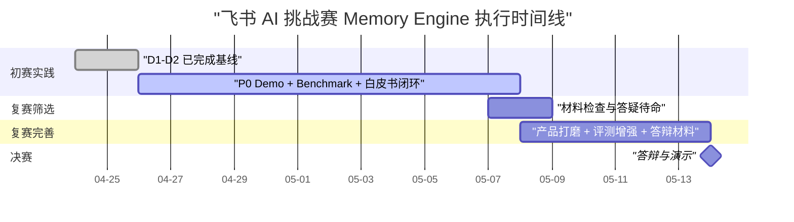

# 飞书 AI 挑战赛总控执行文档

版本：2026-04-25
适用项目：企业级记忆引擎的构造与应用  
当前基线：Day 1 本地 Memory Engine、Day 2 飞书 Bot、Day 3 Bot 稳定化、Day 4 Bitable 看板、Day 5 文档 ingestion 已完成或已提前验收。后续从 D6 开始，逐步吸收 Hermes Agent 的 Memory Provider、Skills、Feishu gateway、定时任务和记忆安全机制，但只作为设计参考，不作为初赛运行时依赖。

## 1. 每日 Codex 执行包模板

每天开工可以使用下面模板：

```text
读取 docs/competition-master-execution-plan.md 中 D{n} 的任务。
同时读取：
1. AGENTS.md
2. docs/day{n-1}-handoff.md
3. 如果存在，读取 docs/day{n}-implementation-plan.md
4. 如果 D{n} 依赖更早某天的能力，只读取对应 day 的 handoff / implementation-plan；不要默认读取所有历史文档。

当前目标：优先完成 P0，P0 完成后继续 P1 加码。
以当前代码库为事实源，历史文档只作为背景、验收标准和风险参考。
要求：
1. 先检查 git status 和当前代码结构。
2. 只改与 D{n} 相关的文件。
3. 新增或更新 docs/day{n}-implementation-plan.md 和 docs/day{n}-handoff.md；handoff 必须包含“给队友先看这个”简明版。
4. 运行必要验证，至少运行仓库 AGENTS.md 指定命令。
5. 检查不要提交 .env、.omx、数据库、缓存、临时报告。
6. 如果当天涉及 Hermes 参考，先读取 docs/hermes-agent-reference-notes.md 和 .reference/hermes-agent/ 下对应文件，只吸收机制，不复制源码。
7. 按 Lore Commit Protocol 提交并 push origin HEAD。
8. 最后总结完成项、验证结果、剩余风险。
```

队友晚上任务模板：

```text
给队友先看这个：
1. 今天已经完成：用一句话说明今天做出的功能或文档。
2. 你今晚从这里开始：写清文件、飞书页面或命令。
3. 你今晚要交付：写清截图、文案、测试记录或修改后的文件。
4. 做对的标准：写清看到什么结果算通过。
5. 遇到问题发我：写清需要发哪段报错、哪张截图或哪个命令输出。

今晚只做这几件事：
1. 打开/运行 `<具体文件或命令>`，看 `<具体结果>` 是否正常。
2. 把不自然的中文文案改得更像真实工作群里的说法。
3. 把测试记录写到 `docs/day{n}-qa-notes.md`，不用改核心代码。
4. 如果卡住，只记录复现步骤和截图，不要自己硬改代码。

今晚不用做：
- 不用处理 `.env`、数据库、飞书 token、真实权限配置。
- 不用改 `memory_engine/` 核心代码，除非当天 handoff 明确写了让你改。
```

## 2. 使用方式

这份文档是后续每天交给 Codex 执行的总控计划。每天开工时，优先复制第 1 节的每日执行包模板，再把当天 D{n} 的任务作为目标范围。

每天收工必须留下四类证据：

1. 可运行代码或可演示脚本。
2. 当天 handoff 文档。
3. 通过的验证命令输出摘要。
4. 已提交并推送到远程仓库。

## 3. 时间线与阶段目标



### 3.1 初赛目标，2026-04-24 至 2026-05-07

初赛优先级最高。目标不是做完整企业知识库，而是证明三个命题：

1. 系统能把飞书协作信息变成可复用记忆。
2. 系统能在干扰、冲突和更新后仍然返回当前有效记忆。
3. 系统能用数据证明节省时间、减少操作步骤或降低重复沟通。

初赛结束时必须具备：

| 交付物 | 初赛最低标准 | 对应仓库产物 |
|---|---|---|
| 《Memory 定义与架构白皮书》 | 明确记忆定义、切入场景、数据流向图、企业价值、安全边界 | `docs/memory-definition-and-architecture-whitepaper.md` |
| 可运行 Demo | CLI replay 可跑，飞书 Bot 可演示 `/remember`、`/recall`、矛盾更新，最好有 Bitable 看板 | `scripts/`、`memory_engine/`、`docs/demo-runbook.md` |
| Benchmark Report | 至少包含抗干扰、矛盾更新、效能指标三类测试，给出数据和解释 | `benchmarks/`、`docs/benchmark-report.md` |
| 提交材料 | README、启动脚本、录屏脚本、答辩摘要 | `README.md`、`docs/submission-checklist.md` |

### 3.2 复赛目标，2026-05-08 至 2026-05-13

复赛不再扩大核心叙事，主要增强观感和可信度：

- 飞书卡片使用真实 interactive card 作为默认体验，文本 fallback 作为稳定兜底。
- Bitable 看板更清晰，能展示记忆状态、版本链、评测结果。
- 增加文档 ingestion、遗忘提醒、OpenClaw/CLI 亮点，但不破坏 P0 稳定性。
- 准备答辩稿、演示录屏、评委可能追问的技术说明。

## 4. 两人分工原则

你全天负责主链路，队友晚上负责高杠杆补位。

| 角色 | 主责 | 不建议承担 |
|---|---|---|
| 你 | Memory Engine、飞书 Bot、Bitable/文档/API 接入、Benchmark runner、最终集成、每日验证和提交 | 大段文案润色、重复人工造数 |
| 队友 | Benchmark 数据集、白皮书段落、Demo 剧本、卡片文案、QA、截图和录屏反馈 | 阻塞主链路的核心代码 |

每晚交接必须可独立执行。你给队友的是“今晚测什么、写什么、产出放哪里”，不是“研究一下”。给队友看的段落要少用缩写和架构词；必须出现技术词时，顺手加一句白话解释。

### 4.1 Hermes Agent 参考边界

本地已拉取 Hermes Agent 源码作为参考：

```text
.reference/hermes-agent/
```

该目录只作为本地参考，已被 `.gitignore` 忽略，不提交到远程仓库。刷新参考源码时使用：

```bash
rm -rf .reference/hermes-agent
git clone --depth 1 https://github.com/NousResearch/hermes-agent.git .reference/hermes-agent
```

后续开发只参考这些机制：

| Hermes Agent 参考点 | 参考文件 | 本项目落点 |
|---|---|---|
| Memory Provider 生命周期 | `.reference/hermes-agent/agent/memory_provider.py` | 设计 `Memory Engine Provider Contract`，让 Agent 能调用 `remember/recall/versions/review_due` |
| Curated memory 与安全扫描 | `.reference/hermes-agent/tools/memory_tool.py` | 记忆注入前做 prompt injection、secret、不可见字符风险检查 |
| Skills 系统 | `.reference/hermes-agent/website/docs/user-guide/features/skills.md` | D11 输出 `feishu-memory-engine` skill / adapter 文档 |
| Persistent memory vs session search | `.reference/hermes-agent/website/docs/user-guide/features/memory.md` | D7-D9 区分 raw event archive、精炼 memory、Benchmark 召回层 |
| Feishu gateway | `.reference/hermes-agent/gateway/platforms/feishu.py` | D6 参考 @mention gating、去重、allowlist、卡片事件、串行处理、fallback |
| Cron scheduler | `.reference/hermes-agent/cron/` | D10 遗忘预警和复习提醒 |

明确不做：

- 不引入 Hermes Agent 作为运行依赖。
- 不复制大段 Hermes 源码。
- 不接它的 TUI、多模型 provider、Skills Hub、Telegram/Discord/Slack gateway。
- 不让 Hermes 适配阻塞初赛三大交付物。

参考笔记见 `docs/hermes-agent-reference-notes.md`。

## 5. 初赛每日任务

说明：

- D1-D5 已完成或提前完成。若你已经完成 Day5，就直接从 D6 开始，不必等日历日期。
- 每天先做 P0，P0 完成后继续做 P1 加码。
- 每天都要更新 handoff，例如 `docs/day3-handoff.md`。
- 每天提交前至少运行仓库规定验证命令；如果当天新增专项测试，也要一起运行。

### D1，2026-04-24，已完成：本地记忆引擎闭环

你的任务：

- 完成 SQLite schema、`remember`、`recall`、版本链、矛盾更新。
- 完成 Day1 benchmark baseline。
- 写 Day1 handoff。

队友任务：

- 检查比赛交付物要求。
- 草拟白皮书目录和 Demo 讲解结构。

验收标准：

- `python3 -m memory_engine benchmark run benchmarks/day1_cases.json` 通过。
- 本地可证明 `A -> B` 覆盖后只召回 B。

### D2，2026-04-25，已完成或提前完成：飞书 Bot 最小闭环

你的任务：

- 接通 `feishu replay` 和 `feishu listen`。
- 支持 `/remember`、`/recall`、`/versions`。
- 通过 `raw_events` 做消息幂等。
- 写 Day2 handoff 和启动脚本。

队友任务：

- 准备 10 条飞书群聊 Demo 输入。
- 检查机器人权限、测试群、回复文案是否能被评委看懂。

验收标准：

- replay fixture 可跑。
- 真实 Bot 如果权限已就绪，能在测试群完成一次记住和查回。
- 如果真实 Bot 未就绪，文档中明确后台待确认项。

Slash 命令候选决策：

- 不把“输入 `/` 后弹出候选命令列表”放入 D2。D2 只证明 `im.message.receive_v1 -> 记忆写入/召回 -> Bot 回复` 的后端闭环。
- 原因：Codex / Claude Code 那种 slash command palette 属于客户端输入辅助；飞书 Bot 收到的是发送后的消息事件，不能通过当前长连接 handler 控制用户正在输入时的候选 UI。
- D3 先做低成本替代：`/help` 返回可用命令、示例和参数说明。
- D6 起将飞书卡片按钮前移为初赛体验增强：真实 interactive card 默认发送，三次明确失败后文本 fallback，timeout 时抑制 fallback；按钮回调先覆盖候选确认、拒绝和查看版本链。H5 页面、聊天框加号菜单或消息快捷操作仍留到复赛评估。

### D3，2026-04-26：真实飞书 Bot 稳定化与 Demo 口径

P0 你的任务：

- 用真实飞书测试群跑通 `/remember`、`/recall`、`/versions`。
- 给 Bot 回复增加稳定格式：类型、主题、状态、版本、来源。
- 对非文本、空消息、机器人自发消息、重复消息、未知命令做明确处理。
- 新增 `docs/day3-handoff.md`，记录真实飞书后台配置和未验证项。

P1 加码：

- 增加 `/help`，展示可用命令、参数示例和 Demo 推荐输入，作为 slash command palette 的 Day 3 替代方案。
- 增加 `/health`，返回数据库路径、默认 scope、dry-run 状态。
- 新增真实飞书 Demo 脚本 `docs/demo-runbook.md` 初稿。

队友晚上任务：

- 按 Demo 脚本在测试群人工跑 2 轮，记录每一步截图需求。
- 把不清晰的 Bot 回复改成评委能秒懂的中文文案。
- 扩写白皮书“为什么不是普通搜索”段落。

验收标准：

- 测试群内能完成：写入决策、召回决策、覆盖更新、查看版本。
- 本地 replay 和真实 Bot 至少一种路径完全可演示。
- `docs/demo-runbook.md` 有 5 分钟演示流程。

### D4，2026-04-27：Bitable 记忆台账和评委可视化

P0 你的任务：

- 设计 Bitable 表结构：`Memory Ledger`、`Memory Versions`、`Benchmark Results`。
- 使用 `lark-cli` 或飞书 API 实现“本地 SQLite -> Bitable 同步”的最小脚本。
- 同步字段至少包括：memory_id、scope、type、subject、current_value、status、version、source、updated_at。
- 增加本地 dry-run，避免没有 Bitable 权限时阻塞。

P1 加码：

- 增加 Bitable 视图建议文档：按 status、type、updated_at 分组。
- 支持将 Benchmark 汇总结果写入 `Benchmark Results`。
- 增加同步失败重试和错误摘要。

队友晚上任务：

- 在飞书多维表格里检查字段命名和展示顺序。
- 输出一份“评委看 Bitable 时的讲解词”。
- 造 20 条不同类型的记忆样例，覆盖 decision、workflow、preference、deadline、risk。

验收标准：

- 不依赖 Bitable 时，本地核心能力不受影响。
- 有权限时，Bitable 能看到 active/superseded 记忆和版本。
- README 或 handoff 记录 Bitable 配置步骤。

### D5，2026-04-28，已完成或提前完成：文档 ingestion 最小闭环

P0 你的任务：

- 实现 `/ingest_doc <url_or_token>` 的本地 handler 或 CLI 命令。
- 读取飞书文档纯文本或用 `lark-cli docs +fetch` 作为第一版入口。
- 从文档中抽取候选记忆，默认 status 可先为 `candidate` 或通过命令确认后入 `active`。
- 记录 evidence：文档 token、标题、摘录 quote。

P1 加码：

- 增加 `/confirm <candidate_id>` 和 `/reject <candidate_id>` 的设计或最小实现。
- 支持从 Markdown 文件导入，便于无飞书权限时演示。
- 增加文档 ingestion fixture。

队友晚上任务：

- 准备 2 份示例飞书文档：架构决策文档、项目周会纪要。
- 在文档中埋入 10 条可抽取记忆和 30 条干扰信息。
- 写白皮书“数据来源与证据链”段落。

验收标准：

- 能从文档或 Markdown 导入至少 5 条候选记忆。
- recall 返回时能说明来源是文档，而不是只说“系统记得”。

### D6，2026-04-29：主题直播后范围校准与卡片化表达

P0 你的任务：

- 根据 4.29 主题直播信息复核项目范围，更新 `docs/day6-scope-adjustment.md`。
- 将 Bot 文本回复升级为真实飞书 interactive card；文本结构化回复只作为 fallback。
- 卡片必须包含：结论、理由、状态、版本、来源、是否被覆盖。
- interactive card 单次发送超时控制在 2 秒内；最多尝试 3 次，三次都明确失败后才调用文本 fallback。
- 严格避免“双发”：真实 interactive card 成功后不得再发送文本 fallback；timeout 属于发送结果未知，必须抑制文本 fallback；fallback 与 card 复用同一 idempotency key，降低重复消息风险。
- 检查权限和安全措辞，避免展示敏感 token、secret、完整内部链接。
- 参考 Hermes `gateway/platforms/feishu.py`，补一份 `docs/day6-hermes-feishu-gateway-notes.md`，只提炼可用机制：@mention gating、消息去重、allowlist、每 chat 串行处理、卡片事件 fallback。
- 在现有飞书 handler 中增强：命令白名单、重复消息提示、interactive card 三次明确失败后回落为纯文本，timeout 时抑制 fallback。

P1 加码：

- 实现低置信候选记忆的人工确认提示。
- 为矛盾更新生成专门的“旧规则 -> 新规则”卡片。
- 增加卡片截图、JSON 源码和真实 interactive card 发送验证记录到文档。
- 接入卡片按钮回调：候选确认、候选拒绝、查看版本链；按钮回调失败时仍可手动输入 `/confirm`、`/reject`、`/versions`。
- 调研并记录飞书是否支持原生 Bot 命令入口或聊天框快捷入口；如果不支持实时 slash 候选，则保留 `/help` + 卡片按钮 + H5/加号菜单作为产品化替代。
- 增加 memory 内容安全扫描的设计说明，参考 Hermes `tools/memory_tool.py`，先覆盖 prompt injection、secret、不可见字符三类风险。

队友晚上任务：

- 整理主题直播对本课题的要求变化和评分偏好。
- 从评委视角改写卡片标题和字段名。
- 扩写白皮书“飞书生态接入价值”段落。
- 从评委视角检查：卡片里是否能看出“这是企业记忆，不是普通聊天摘要”。

验收标准：

- `docs/day6-scope-adjustment.md` 明确哪些内容进入初赛，哪些延后到复赛。
- 真实 interactive card 或结构化文本 fallback 能支撑 Demo 截图。
- 按钮回调能在测试群完成候选确认、拒绝或查看版本链中的至少一个闭环。
- `docs/day6-hermes-feishu-gateway-notes.md` 明确哪些 Hermes 机制被吸收、哪些被拒绝。

### D7，2026-04-30：Benchmark 扩容，抗干扰测试成型

P0 你的任务：

- 扩展 benchmark runner，支持批量注入关键记忆、干扰对话、查询和期望答案。
- 新增抗干扰数据集：至少 50 条关键记忆、500 条干扰、50 条查询。
- 输出 Recall@1、Recall@3、MRR、平均延迟。
- 生成 `docs/benchmark-report.md` 初稿。
- 参考 Hermes persistent memory 文档，把评测数据分成三层：raw events、curated memories、recall logs；报告中解释为什么 raw archive 和 active memory 要分层。

P1 加码：

- 干扰规模提升到 1000 条。
- 增加按 type 和 subject 的分项指标。
- 将结果同步到 Bitable 或导出 CSV。
- 如果实现成本低，给 `raw_events` 或 benchmark 临时库增加 FTS5 检索，用于失败样例定位；不要把 FTS5 替代 active memory 状态机。

队友晚上任务：

- 继续补抗干扰测试集，确保干扰内容真实像群聊。
- 人工检查 20 条失败或边界样例，标注失败原因。
- 写 Benchmark Report 的“测试集设计”段落。
- 对照 Hermes “Memory vs Session Search”叙事，帮报告补一段：为什么长期记忆不是把所有聊天都塞进 prompt。

验收标准：

- 抗干扰测试可一键运行。
- 报告中有指标表，不只写主观描述。

### D8，2026-05-01：矛盾更新评测和版本可解释性

P0 你的任务：

- 新增矛盾更新专项数据集：至少 30 组 `old -> new -> query`。
- 指标包括 Current Answer Accuracy、Stale Leakage Rate、Version Trace Coverage。
- recall 默认只返回 active；`/versions` 能解释旧值为什么被覆盖。
- 将结果写入 `docs/benchmark-report.md`。
- 参考 Hermes MemoryProvider 的 tool schema 思路，把 `recall`、`versions`、`remember` 的输入输出契约写入 `docs/memory-engine-provider-contract.md` 初稿。

P1 加码：

- 增加“没有明确覆盖意图时进入人工复核”的测试。
- 增加旧记忆泄漏检测：返回中不应出现旧收件人、旧参数、旧截止日期。
- 增加对多轮更新 `A -> B -> C` 的版本链测试。
- 给 provider contract 增加 `prefetch(query)` 和 `on_memory_write(...)` 的未来接口说明，但不在 D8 强行实现。

队友晚上任务：

- 设计更接近真实人的冲突表达，例如“刚才说错了”“统一改成”“以后不要用”。
- 检查版本链输出是否可解释。
- 写白皮书“记忆更新与遗忘机制”段落。
- 检查 provider contract 是否能被非本项目 Agent 理解：输入是什么、输出是什么、什么情况必须人工确认。

验收标准：

- 矛盾更新测试可一键运行。
- 报告能证明系统理解时序和覆盖关系。

### D9，2026-05-02：效能指标验证与报告自动生成

P0 你的任务：

- 增加效能指标脚本，量化使用前后字符数、步骤数、耗时估算。
- 设计至少 5 个任务对比：查历史决策、找部署参数、确认周报收件人、定位负责人、查截止日期。
- 生成 Markdown 指标表，合并进 `docs/benchmark-report.md`。
- 更新 README 的 Benchmark 运行入口。
- 借鉴 Hermes `/insights` 的思路，把 Benchmark 输出拆成“机器可读 JSON/CSV”和“评委可读 Markdown 摘要”，但只提交汇总和必要 fixture。

P1 加码：

- 自动生成 `reports/` 下的 JSON/CSV 原始结果，文档只提交汇总。
- 增加简单图表数据，供 Bitable 或 PPT 使用。
- 增加 demo 命令 `python3 -m memory_engine benchmark all`。
- 增加 `memory benchmark explain` 或报告生成脚本，把失败样例、召回来源和版本状态自动写入报告草稿。

队友晚上任务：

- 用人工计时方式跑 3 个场景，给出“无记忆 vs 有记忆”的真实感估算。
- 检查报告中是否明确覆盖交付物要求的三类测试。
- 写 Benchmark Report 的“结论与局限”段落。

验收标准：

- `docs/benchmark-report.md` 包含抗干扰、矛盾更新、效能指标三节。
- 每节都有数据、解释和可复现实验命令。

### D10，2026-05-03：遗忘预警和记忆生命周期

P0 你的任务：

- 实现或模拟 stale 机制：基于 importance、last_recalled_at、updated_at 判断需要复习的记忆。
- 增加 CLI 或 Bot 命令：`/review_due`，返回即将遗忘或需复核的团队记忆。
- 将 stale/archived 的状态定义写入白皮书。
- 增加最小测试，证明 active、superseded、stale 的召回行为不同。
- 参考 Hermes `cron/` 和 MemoryProvider `on_turn_start/on_session_end` 钩子，把遗忘预警定义成“调度触发 + 会话触发”两种模式；初赛只实现本地命令或模拟 scheduler。

P1 加码：

- 增加“复习后延长下次提醒时间”的逻辑。
- 将复习提醒同步到 Bitable 视图。
- 设计 Ebbinghaus 风格的遗忘曲线说明图。
- 如果有余力，增加 `scripts/review_due_once.sh`，作为未来 cron job 的可运行入口。

队友晚上任务：

- 写“团队知识断层与遗忘预警”的产品说明。
- 设计 5 条适合复习提醒的团队记忆。
- 检查这个能力是否会干扰 P0 Demo，提出删减建议。

验收标准：

- 遗忘预警不影响默认 recall 的准确性。
- Demo 可以用 30 秒讲清楚“为什么这不是普通搜索”。

### D11，2026-05-04：CLI/OpenClaw/Hermes 亮点和端到端脚本

P0 你的任务：

- 整理 CLI 侧工作流记忆：常用命令、部署参数、项目路径偏好。
- 实现一个可演示命令，例如 `memory recall "生产部署"` 输出推荐命令和来源证据。
- 编写 `scripts/demo_seed.py` 或等价脚本，一键初始化 Demo 数据。
- 编写 `scripts/run_demo_check.sh`，串起 init、remember、recall、benchmark。
- 创建 `agent_adapters/hermes/memory_provider_contract.md`，把 D8 的 provider contract 固化为 Hermes-style 适配说明。
- 创建 `agent_adapters/openclaw/feishu_memory_engine.skill.md` 或同等 `SKILL.md`，采用 Hermes Skills 的 progressive disclosure 格式，说明 Agent 何时调用本项目 CLI。

P1 加码：

- 如果 OpenClaw 官方插件接入成本低，补一个 OpenClaw/飞书 CLI 调用示例。
- 增加“先预览，再确认”的写操作安全说明。
- 将 CLI 亮点写入 Demo runbook。
- 增加一个保底演示：Agent 读取 skill 文档后，用 CLI 完成 `recall -> 生成飞书回复文案 -> dry-run`。
- 明确禁止自动写入团队记忆：Agent 只能提出候选，必须经 `/confirm` 或明确覆盖意图才入库。

队友晚上任务：

- 根据真实演示节奏改写 5 分钟 Demo 剧本。
- 检查所有命令是否能复制粘贴执行。
- 整理演示录屏分镜：开场、记忆注入、抗干扰、矛盾更新、指标报告。

验收标准：

- 新机器或干净数据库能通过脚本复现 Demo 数据。
- CLI 亮点不依赖真实飞书权限，也能作为保底演示。
- OpenClaw/Hermes 亮点是 adapter 文档 + CLI 演示，不是引入 Hermes Agent 运行时。

### D12，2026-05-05：白皮书完整初稿

P0 你的任务：

- 创建或补齐 `docs/memory-definition-and-architecture-whitepaper.md`。
- 白皮书必须覆盖：记忆定义、场景选择、数据流向图、架构模块、状态机、飞书生态、权限安全、Demo、Benchmark。
- 将 Mermaid 图源码或链接整合进白皮书。
- 对照交付物要求逐条自查。
- 加入“Hermes Agent 参考但不依赖”的架构段：说明本项目吸收 Memory Provider、Skills、Gateway 安全经验，但核心是飞书企业记忆中间层。

P1 加码：

- 增加“为什么这个方案适合企业级，而不是个人笔记”的论证。
- 增加“局限与复赛路线”章节。
- 增加关键 API 与权限表。
- 增加“Agent 入口”小节：飞书 Bot 面向人，OpenClaw/Hermes Skill 面向 Agent，二者共享 Memory Engine Core。

队友晚上任务：

- 做白皮书文字润色和结构审查。
- 检查是否能让非工程评委理解“记忆引擎”的价值。
- 标出需要截图、表格或图示补强的位置。

验收标准：

- 白皮书不再是提纲，而是可提交初稿。
- 每个核心判断都有对应 Demo 或 Benchmark 证据支撑。

### D13，2026-05-06：初赛冻结前 QA 和材料打包

P0 你的任务：

- 做全流程 QA：本地 CLI、feishu replay、真实 Bot 或 dry-run、benchmark、Bitable 同步。
- 修复会影响 5 分钟 Demo 的阻塞问题。
- 更新 README：项目介绍、快速开始、Demo 路径、Benchmark 路径、飞书配置说明。
- 创建 `docs/submission-checklist.md`。
- 检查 `.reference/hermes-agent/` 仍然被忽略，不进入提交；README 只链接上游仓库和本项目参考笔记。

P1 加码：

- 增加 GitHub Actions 或本地 `scripts/verify.sh`。
- 增加故障排查文档：权限、lark-cli profile、数据库路径、重复消息。
- 准备录屏或截图清单。
- 增加 adapter QA：验证 `agent_adapters/` 文档中的命令都能复制执行或明确标注为未来接口。

队友晚上任务：

- 按 submission checklist 逐项验收。
- 完成 Benchmark Report 终稿审阅。
- 录第一版 Demo 视频或至少准备截图证据。

验收标准：

- 任意一天坏掉的功能都不能留到 D14。
- README 足够让评委或队友复现核心流程。

### D14，2026-05-07：初赛提交日和筛选缓冲

P0 你的任务：

- 最后一次从干净状态跑完整验证。
- 固定 Demo 数据和演示顺序。
- 打 tag 或记录提交 hash。
- 确认远程仓库包含所有初赛交付物，不包含 `.env`、`.omx/`、数据库文件和临时报告。
- 确认 `.reference/`、Hermes 源码、临时 reports、数据库均未提交；提交物只包含本项目代码和参考笔记。

P1 加码：

- 生成一页式项目摘要，放入 `docs/submission-summary.md`。
- 准备评委问题速答：为什么选这个场景、为什么不是向量库、如何处理权限、如何证明价值。
- 准备 Hermes 相关答辩口径：我们参考其 Agent memory 机制，但产品形态是飞书企业记忆中间层，不是二次封装 Hermes。

队友晚上任务：

- 做最终材料检查。
- 用非开发者视角走一遍 README。
- 整理复赛待办，不在提交前临时加大改动。

验收标准：

- 初赛三个交付物齐全：白皮书、Demo、Benchmark Report。
- `git status --short --ignored` 确认敏感和临时文件未提交。
- 远程仓库 main 分支是可提交状态。

## 6. 复赛与决赛每日任务

复赛任务只在初赛 P0 稳定后执行。不要为了复赛加分破坏初赛 Demo。

### R0，2026-05-07 至 2026-05-08：筛选期待命

你的任务：

- 不做大重构。
- 只修复明确影响提交材料的问题。
- 记录评审反馈和主题直播后的新要求。

队友任务：

- 收集反馈、问题、评委可能关注点。
- 整理复赛优先级列表。

验收标准：

- 仓库始终保持可运行。

### R1，2026-05-08：反馈 triage 和复赛路线冻结

你的任务：

- 根据反馈把复赛任务分成 Must、Should、Could。
- 选择最多两个产品加分点；交互卡片已在 D6 前移，R1 建议优先：Bitable 看板、Agent adapter / Hermes-style Memory Provider、卡片视觉打磨。
- 冻结复赛 Demo 主线，不再换题。
- 如果初赛评委对 Agent 入口感兴趣，复赛把 `agent_adapters/hermes/` 升级为可运行 provider prototype；否则只保留文档和 CLI skill。

队友任务：

- 把评委反馈转成答辩问题清单。
- 更新演示稿大纲。

验收标准：

- 有 `docs/final-round-plan.md`。

### R2，2026-05-09：产品观感增强

你的任务：

- 在 D6 已落地真实 interactive card 与按钮回调的基础上，继续优化视觉密度、按钮文案和失败兜底提示。
- 增加更清晰的 Bitable 视图。
- 保留文本 fallback，避免卡片明确失败影响演示；timeout 仍优先抑制 fallback，避免双发。
- 如果 D6 interactive card 稳定，再实现命令发现入口：机器人菜单、H5 命令面板、聊天框加号入口或消息快捷操作；不追求复刻 Codex/Claude Code 的实时输入候选，除非飞书客户端原生支持。
- 对照 Hermes Feishu gateway，再补一轮消息安全和体验：allowlist、重复事件提示、卡片事件失败 fallback。

队友任务：

- 做卡片文案和截图审查。
- 检查移动端和桌面端显示效果。

验收标准：

- Demo 视觉效果明显强于初赛，但不牺牲稳定性。

### R3，2026-05-10：评测可信度增强

你的任务：

- 扩大抗干扰和矛盾更新测试规模。
- 增加失败案例分析和指标解释。
- 输出更适合答辩展示的图表数据。
- 增加 Agent adapter 评测：Agent 调用 `recall` 后生成正确回复或命令的成功率、节省步骤数。

队友任务：

- 将 Benchmark 结果整理成答辩页。
- 准备“指标为什么可信”的讲解。

验收标准：

- Benchmark Report 有复赛版数据和图表。

### R4，2026-05-11：安全、权限和企业化论证

你的任务：

- 补齐权限边界、最小权限、写操作确认、证据可追踪、数据隔离说明。
- 检查日志和回复中不泄露 secret、token、内部敏感配置。
- 增加异常场景处理说明。
- 参考 Hermes memory safety，补齐记忆内容安全扫描：prompt injection、secret exfiltration、不可见字符、越权来源。

队友任务：

- 准备评委追问回答：隐私、安全、误记、误召回、旧记忆污染。
- 审查白皮书安全章节。

验收标准：

- 答辩时可以主动讲清楚企业级安全边界。

### R5，2026-05-12：最终答辩材料

你的任务：

- 准备演示环境、固定脚本、录屏保底。
- 写 `docs/final-demo-script.md`。
- 固定最终提交 hash。
- 准备 30 秒 Hermes 参考说明：借鉴 Agent memory provider 和 skill 形态，但不依赖外部 Agent，避免被追问为“套壳”。

队友任务：

- 制作或整理 PPT 内容。
- 按 5 分钟和 10 分钟两个版本练习讲解。

验收标准：

- 即使现场网络或飞书权限出问题，也有 replay 和录屏保底。

### R6，2026-05-13：最终彩排和冻结

你的任务：

- 只修阻塞 bug，不再改架构。
- 清理 README、白皮书、Benchmark Report、Demo runbook 的矛盾表述。
- 再跑完整验证。

队友任务：

- 做最终彩排计时。
- 准备 Q&A 备忘。

验收标准：

- 所有材料版本一致。
- 现场演示和录屏演示都能讲通。

### Final，2026-05-14：决赛

你的任务：

- 按固定 Demo 路线演示。
- 如果现场失败，立即切 replay 或录屏，不临场修代码。
- 回答技术问题时围绕“定义、构建、证明”三点。

队友任务：

- 记录评委问题。
- 控制时间和切换材料。

## 7. 交付物完成定义

### 7.1 白皮书完成定义

必须回答：

- 企业环境下什么是有价值记忆。
- 为什么选择项目决策、矛盾更新、遗忘预警、CLI 工作流记忆。
- 记忆如何提取、存储、检索、更新、遗忘。
- 飞书 Bot、文档、Bitable、CLI/OpenClaw/Hermes-style Skill 如何流转。
- 权限和安全边界如何设计。
- Benchmark 如何证明价值。

### 7.2 Demo 完成定义

必须演示：

- 在 CLI 或飞书端注入记忆。
- 中间加入大量干扰后仍能召回。
- 输入冲突更新后旧记忆不再默认返回。
- 能展示证据来源和版本链。
- 有一键 replay 或 seed 脚本作为保底。
- 如果展示 Agent 入口，只展示轻量 adapter 或 skill 调用，不依赖 Hermes 运行时。

### 7.3 Benchmark Report 完成定义

必须包含：

- 抗干扰测试：大量无关对话或操作后，召回一周前或早前注入的关键记忆。
- 矛盾更新测试：`A -> B` 冲突输入后，只返回 B，并能解释 A 被覆盖。
- 效能指标验证：字符数、步骤数、时间或问答轮次的量化对比。
- 测试命令、数据集规模、指标结果、失败案例和局限。

## 8. 风险和降级策略

| 风险 | 触发信号 | 降级策略 |
|---|---|---|
| 飞书真实 Bot 权限未通过 | `listen` 收不到真实消息或无法回复 | 用 `feishu replay`、截图和 dry-run 演示核心逻辑，文档记录后台待确认项 |
| Bitable 权限或 API 不稳定 | 同步失败或字段创建失败 | 本地 SQLite 为主，Bitable 作为可选可视化副本 |
| 文档读取权限阻塞 | 无法拉取 docx raw content | 用 Markdown fixture 和 `lark-cli docs +fetch` 替代 |
| Benchmark 指标不够好 | Recall@3 或旧值泄漏不达标 | 缩小 P0 场景，强化规则检索和 subject 归一化，先证明关键场景 |
| 时间不足 | D10 前白皮书或报告仍空 | 暂停 H5、embedding、复杂卡片，集中完成三大交付物 |
| 队友时间不稳定 | 晚上 QA 无法完成 | 你白天优先写可复现脚本，队友任务只作为增强 |
| Hermes 参考范围失控 | 开始引入完整 Agent/TUI/多平台 gateway | 立即降级为文档参考，只保留 MemoryProvider contract 和 SKILL.md |
| 误提交外部源码 | `git status` 出现 `.reference/hermes-agent` 或大量上游文件 | 停止提交，确认 `.reference/` 在 `.gitignore`，只提交参考笔记和本项目代码 |

## 9. 当前下一步

从当前仓库状态看，Day 5 文档 ingestion 已完成或提前完成，D6 已前移真实 interactive card 与按钮回调，下一步应继续推进 D7：

1. 扩容 Benchmark 抗干扰数据集。
2. 将真实 interactive card 截图和按钮回调录屏纳入 Demo 证据。
3. 在 D6 安全表达基础上评估是否将 prompt injection、secret、不可见字符扫描前移到写入层。
4. 直播后再复核 D6 scope，不基于尚未发生的直播预设结论。

如果主题直播信息暂时不可用，D7 Benchmark 不被阻塞；D6 文档中的直播后复核项保留为待补。
