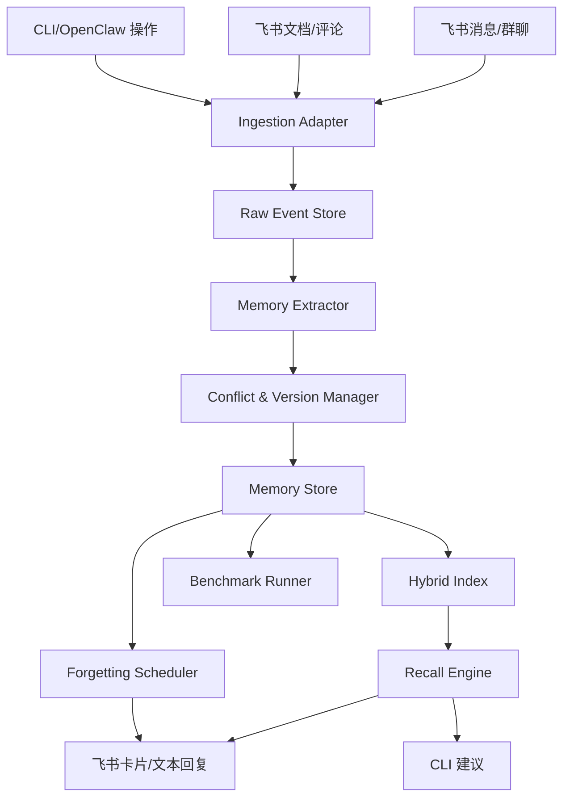
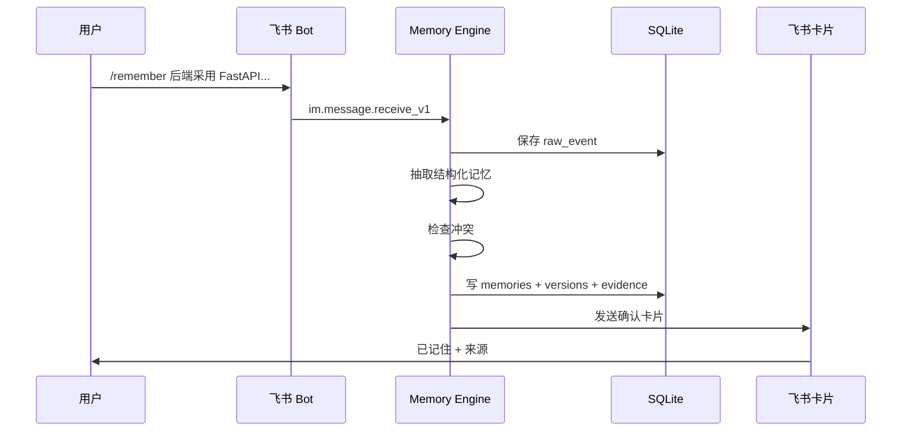

# 飞书 Memory Engine 调研与项目规划

生成日期：2026-04-24  
适用课题：企业级记忆引擎的构造与应用  
建议项目名：MemoryOps / Feishu Memory Engine

## 0. 执行摘要

本项目建议聚焦“飞书项目决策记忆 + 团队遗忘预警 + CLI/OpenClaw 轻量执行记忆”，不要做泛化的企业知识库搜索。比赛真正需要证明的是：系统能把企业协作中的关键上下文变成可验证、可更新、可遗忘、可主动召回的记忆。

推荐 MVP：

1. 飞书群聊或文档中用 `/remember` 或 @机器人注入关键记忆。
2. 系统从消息、文档、评论或 CLI 操作中提取结构化记忆。
3. 记忆以 `active / superseded / stale / archived` 状态管理，保留版本链和证据源。
4. 后续讨论触发相关话题时，机器人推送“历史决策卡片”。
5. 矛盾更新时旧记忆不删除，而是标记为 `superseded`，新记忆成为 `active`。
6. 通过抗干扰测试、矛盾更新测试、效能指标验证证明价值。

两人团队的最优打法：

- 你全天负责主线闭环：服务端、记忆引擎、飞书 Bot、OpenClaw/CLI 集成、最终集成。
- 队友晚上负责高杠杆补位：测试集、Benchmark、白皮书、Demo 脚本、卡片文案、QA。

## 1. 官方文档调研结论

### 1.1 飞书开放平台整体能力

官方开放平台将飞书定位为企业信息枢纽和业务入口。可开发形态包括机器人、网页应用 H5、小组件 Block。对 Memory Engine 最有用的是机器人 + H5 + 服务端 OpenAPI + CLI/OpenClaw 插件。

官方概述提到飞书开放平台提供 2500 多个标准化服务端 API，覆盖消息与群组、通讯录、云文档、多维表格、日历等能力。对本项目来说，它们分别对应：

| 飞书能力 | Memory Engine 用法 |
|---|---|
| 消息与群组 | 接收群聊/单聊上下文、发送记忆卡片、回复线程、读取历史消息 |
| 云文档 | 读取设计文档、周报、会议纪要，提取决策和 TODO |
| 多维表格 | 作为可视化记忆台账、Benchmark 结果表、人工审核队列 |
| 日历 | 遗忘提醒、决策复盘提醒、会议上下文关联 |
| 通讯录 | 人员、团队、权限范围、负责人字段 |
| H5 网页应用 | 记忆确认页、检索页、管理台、人工审核界面 |
| 飞书 CLI / OpenClaw 插件 | 快速 Demo、Agent 调用飞书工具、CLI 侧记忆流转 |

来源：

- https://open.feishu.cn/document/client-docs/intro
- https://open.feishu.cn/document/home/index

### 1.2 消息与群组能力

消息是 Memory Engine 的主入口。飞书消息 API 支持发送文本、富文本、卡片、群名片、个人名片、图片、视频、音频、文件、表情包等。

关键 API：

- 接收消息事件：`im.message.receive_v1`
- 发送消息：`POST /open-apis/im/v1/messages`
- 获取会话历史消息：`GET /open-apis/im/v1/messages`
- 回复消息、查询指定消息、获取消息资源、消息表情、Pin 消息等可作为后续增强

接收消息事件要点：

- 需要开启机器人能力。
- 需要在应用中配置事件订阅，订阅消息与群组分类下的接收消息 v2.0 事件。
- 单聊消息需要 `im:message.p2p_msg:readonly` 或历史权限。
- 群聊 @ 机器人消息需要 `im:message.group_at_msg:readonly` 或历史权限。
- 群聊所有消息需要 `im:message.group_msg` 或 `im:message.group_msg:readonly`，这是敏感权限，比赛 MVP 不建议一开始依赖。
- 可能收到重复推送，如需幂等应使用 `message_id` 去重，不要依赖 `event_id`。

发送消息要点：

- 发送给用户时，用户必须在机器人的可用范围内。
- 发送给群组时，机器人必须在群里且有发言权限。
- 对同一用户发送消息限频 5 QPS，对同一群组限频为群内机器人共享 5 QPS。
- 文本消息请求体最大 150 KB，卡片和富文本请求体最大 30 KB。
- 支持 `uuid` 做 1 小时内请求去重，建议 Memory Engine 的主动提醒和 Benchmark 推送都使用。

历史消息要点：

- 获取历史消息时，机器人必须在被查询的群组中。
- 群聊历史消息通常需要额外群聊消息权限。
- 单次 `page_size` 1-50。
- 可按 `start_time`、`end_time`、`sort_type` 分页拉取。
- 对普通对话群的话题消息，`chat` 容器只能获取根消息；需要 `thread` 容器获取话题回复。

MVP 建议：

- 第一阶段只处理机器人被 @ 的消息和 `/remember` 指令，避免申请群聊全量消息敏感权限。
- Benchmark 阶段可用本地模拟消息流或测试群中 @ 机器人灌入数据。
- 如果要做“自动从所有群消息中提取记忆”，放到 P1/P2，避免权限阻塞。

来源：

- https://open.feishu.cn/document/uAjLw4CM/ukTMukTMukTM/reference/im-v1/message/events/receive
- https://open.feishu.cn/document/uAjLw4CM/ukTMukTMukTM/reference/im-v1/message/create
- https://open.feishu.cn/document/uAjLw4CM/ukTMukTMukTM/reference/im-v1/message/list

### 1.3 长连接事件订阅

飞书 SDK 支持长连接模式，通过 WebSocket 全双工通道接收事件，不需要公网 IP 或公网域名，适合本地开发和比赛 Demo。

关键结论：

- 长连接仅支持企业自建应用。
- 只要运行环境能访问公网即可，不需要内网穿透。
- 内置通信加密和鉴权，不需要自己做解密、验签。
- 接收到消息后，需要 3 秒内处理完成且不抛异常，否则触发超时重推。
- 每个应用最多建立 50 个连接。
- 多客户端是集群模式，不是广播模式，同一事件只会随机推给其中一个客户端。

Memory Engine 实现建议：

- 事件回调中只做轻量处理：验重、落原始事件、入队列，立即返回。
- 抽取、LLM 判断、embedding、冲突检测等耗时任务放异步 worker。
- `message_id` 建唯一索引，避免重推导致重复记忆。
- 单机 Demo 可用 Python SDK `lark-oapi` 或 Node SDK；生产设计中建议消息队列隔离。

来源：

- https://open.feishu.cn/document/server-docs/event-subscription-guide/event-subscription-configure-/request-url-configuration-case

### 1.4 飞书卡片

飞书卡片是本项目“证明它记住了”的核心展示层。它可以将结构化内容嵌入聊天消息、群置顶、链接预览等协作场景，并支持轻量交互。

官方描述中，飞书卡片的关键特性包括：

- 结构化呈现图文内容。
- 嵌入聊天消息、群置顶、链接预览。
- 支持按钮等轻交互。
- 支持图表组件。
- 可通过模板复用。
- AI 机器人场景支持流式更新卡片。

Memory Engine 的卡片类型：

1. 记忆确认卡片
   - 展示系统从消息中抽取的候选记忆。
   - 按钮：确认记忆、编辑、忽略。

2. 历史决策卡片
   - 当相关话题出现时推送。
   - 字段：决策主题、当前结论、理由、反对方案、证据来源、更新时间、置信度。
   - 按钮：沿用决策、重新打开、标记过期。

3. 矛盾更新卡片
   - 当新输入和旧记忆冲突时推送。
   - 展示旧值和新值。
   - 按钮：覆盖旧记忆、保留两者、人工确认。

4. 遗忘预警卡片
   - 当关键记忆长期未被召回或接近到期时推送。
   - 按钮：复习、延后、废弃。

MVP 建议：

- P0 可先发送普通文本或简化 JSON 卡片。
- P1 做交互卡片按钮。
- P2 做流式卡片和图表。

来源：

- https://open.feishu.cn/document/uAjLw4CM/ukzMukzMukzM/feishu-cards/feishu-card-overview

### 1.5 云文档能力

云文档用于长期知识源和证据源。项目设计中，飞书文档里的架构设计、会议纪要、PRD、周报都可以成为记忆候选来源。

关键 API：

- 获取文档纯文本内容：`GET /open-apis/docx/v1/documents/:document_id/raw_content`
- 获取文档所有块、获取块、创建块、更新块、批量更新块等可作为后续增强

纯文本读取要点：

- 单个应用调用频率上限 5 次/秒。
- 调用身份需要有文档阅读或编辑权限。
- 权限可以是 `docx:document:readonly` 或 `docx:document`。
- 使用 `tenant_access_token` 时，应用本身需要被加入文档权限。
- 使用 `user_access_token` 时，当前用户需要文档权限。
- 纯文本过大可能返回 `raw content size exceed limited`。

Memory Engine 实现建议：

- P0 不做全量文档扫描，只支持用户粘贴文档链接或在 Bot 中 `/ingest_doc <url>`。
- 读取后按标题、段落、列表项分块。
- 抽取记忆时保留文档 ID、标题、段落摘要、块 ID 或文本偏移作为 evidence。
- 如果是会议纪要/周报，优先抽取 deadline、owner、decision、risk、follow-up。

来源：

- https://open.feishu.cn/document/server-docs/docs/docs/docx-v1/document/raw_content

### 1.6 多维表格能力

多维表格很适合作为比赛 Demo 的“可视化记忆台账”和人工审核面板，但不建议把它作为唯一真实数据库。真实检索需要 SQLite/Postgres + FTS/embedding；多维表格负责展示、人工纠错和评测结果呈现。

关键 API：

- 创建多维表格：`POST /open-apis/bitable/v1/apps`
- 列出记录：`GET /open-apis/bitable/v1/apps/:app_token/tables/:table_id/records`
- 新增记录：`POST /open-apis/bitable/v1/apps/:app_token/tables/:table_id/records`
- 更新记录：`PUT /open-apis/bitable/v1/apps/:app_token/tables/:table_id/records/:record_id`
- 查询记录、新增字段、列出字段、更新字段、视图等作为增强

限制与坑：

- 创建多维表格频率 20 次/分钟。
- 新增/更新记录频率 50 次/秒。
- 列出记录单次最多 500 行，旧接口已不推荐，推荐使用查询记录。
- 多维表格最多 20,000 条记录。
- 同一个数据表不支持并发调用写接口，可能出现 `Write conflict`。
- 写入时字段名称需要和页面字段完全匹配，空格和特殊符号也会影响。
- 应用或用户必须有多维表格编辑权限。

建议表设计：

1. `Memory Records`
   - `memory_id`
   - `scope`
   - `type`
   - `subject`
   - `current_value`
   - `status`
   - `confidence`
   - `source_type`
   - `source_url`
   - `created_at`
   - `updated_at`
   - `expires_at`

2. `Memory Versions`
   - `memory_id`
   - `version`
   - `old_value`
   - `new_value`
   - `change_reason`
   - `changed_by`
   - `source_url`

3. `Benchmark Results`
   - `case_id`
   - `case_type`
   - `query`
   - `expected`
   - `actual`
   - `hit_rank`
   - `latency_ms`
   - `passed`

MVP 建议：

- 本地 SQLite 为主存储。
- 多维表格同步写入“可视化副本”即可。
- 避免在高并发 Benchmark 中直接写飞书多维表格，先写本地结果，最后汇总同步。

补充判断：

从“比赛展示”和“飞书生态原生性”的角度，多维表格也可以被包装为 Memory Engine 的结构化主存储，因为它天然支持字段、记录、视图、人员、日期、附件、关联和人工协作。更稳的表述是采用“双层存储”：

- **飞书多维表格 = 官方生态可见的结构化 Memory Store**，用于评委演示、人工审核、团队协作和 Benchmark 结果看板。
- **SQLite / 本地索引 = 检索与评测执行层**，用于 FTS、embedding、批量评测、低延迟召回和避免 Bitable 并发写冲突。

这样既能贴合飞书题目，又不会把性能、并发和复杂检索全部压在 Bitable 上。

来源：

- https://open.feishu.cn/document/uAjLw4CM/ukTMukTMukTM/reference/bitable-v1/app/create
- https://open.feishu.cn/document/uAjLw4CM/ukTMukTMukTM/reference/bitable-v1/app-table-record/create
- https://open.feishu.cn/document/uAjLw4CM/ukTMukTMukTM/reference/bitable-v1/app-table-record/batch_create
- https://open.feishu.cn/document/uAjLw4CM/ukTMukTMukTM/reference/bitable-v1/app-table-record/search
- https://open.feishu.cn/document/uAjLw4CM/ukTMukTMukTM/reference/bitable-v1/app-table-record/update
- https://open.feishu.cn/document/uAjLw4CM/ukTMukTMukTM/reference/bitable-v1/app-table-record/list

### 1.6.1 云文档与 Bitable 事件补充

除了消息事件，飞书还可通过云文档事件做增量 ingestion：

- 订阅云文档事件：`POST /open-apis/drive/v1/files/:file_token/subscribe`
- 文件编辑事件：`drive.file.edit_v1`
- 文件夹下文件创建事件：`drive.file.created_in_folder_v1`
- 多维表格记录变更事件：`drive.file.bitable_record_changed_v1`

这些事件适合 P1/P2：

- 监听“项目知识库”文件夹中新建的 PRD、会议纪要、技术方案。
- 监听已订阅文档的编辑事件，增量更新候选记忆。
- 监听多维表格记录变更，让人工在 Bitable 中修正的记忆同步回本地索引。

注意事项：

- 云文档权限是资源级权限，应用身份访问时通常需要将应用加入对应文档/文件夹权限。
- 文件编辑事件适合做“有变更，需要重新拉取并抽取”的触发器，不建议把事件本身当完整内容。
- 对 Bitable 记录变更事件要做幂等处理，避免本地同步与人工编辑互相触发循环。

来源：

- https://open.feishu.cn/document/uAjLw4CM/ukTMukTMukTM/reference/drive-v1/file/subscribe
- https://open.feishu.cn/document/ukTMukTMukTM/uUDN04SN0QjL1QDN/event/file-edited
- https://open.feishu.cn/document/uAjLw4CM/ukTMukTMukTM/reference/drive-v1/file/events/created_in_folder
- https://open.feishu.cn/document/uAjLw4CM/ukTMukTMukTM/reference/drive-v1/file/events/bitable_record_changed

### 1.7 鉴权与权限

自建应用可通过 `tenant_access_token` 调用应用身份 API。

关键点：

- `tenant_access_token` 最大有效期 2 小时。
- 剩余有效期小于 30 分钟时重新调用会返回新 token。
- 剩余有效期大于等于 30 分钟时会返回原 token。
- 应用身份适合机器人、后台服务、团队公共记忆。
- 用户身份适合读取用户个人消息、日历、文档等，需要 OAuth 授权。

MVP 权限建议：

最低可行权限：

- `im:message.p2p_msg:readonly`
- `im:message.group_at_msg:readonly`
- `im:message:send_as_bot`
- `docx:document:readonly`
- `bitable:app` 或细粒度 base 权限

如果用 CLI/OpenClaw 用户身份：

- `im:message`
- `im:message:readonly`
- `im:message.group_msg:get_as_user`
- `search:message`
- `docs:document.content:read`
- `base:record:*`
- `calendar:*` 等按 Demo 场景增量申请

安全建议：

- P0 使用机器人身份，权限边界更清楚。
- 用户身份只用于个人 Demo，不要把用户授权机器人分享给多人使用。
- 所有写操作必须先预览再确认。
- 如果未来做商店应用，还需要处理 `app_ticket` 事件来换取 `app_access_token`；比赛 MVP 建议只做企业自建应用。

来源：

- https://open.feishu.cn/document/ukTMukTMukTM/ukDNz4SO0MjL5QzM/auth-v3/auth/tenant_access_token_internal
- https://open.feishu.cn/document/uAjLw4CM/ukTMukTMukTM/application-v6/event/app_ticket-events

### 1.8 H5 / JSAPI / 管理台能力

飞书 H5 适合作为记忆确认页、检索页和管理台。

关键结论：

- H5 应用运行在飞书客户端内，本质是网页容器。
- 可从工作台、搜索结果、聊天框加号菜单、消息快捷操作进入。
- JSAPI 鉴权使用 `h5sdk.config`。
- `requestAccess` 可做推荐免登与增量授权。
- `requestAccess` 返回 code 有效期 3 分钟且只能用一次。
- `requestAuthCode` 是历史接口，官方已停止维护，但可作为旧客户端 fallback，code 有效期 5 分钟。
- 多数 JSAPI 需要先配置可信域名和完成鉴权。
- 新容器可能打断鉴权上下文，跳转后一般要重新 `config`。

适合的 H5 页面：

1. `/memory/inbox`
   - 候选记忆审核队列。

2. `/memory/search`
   - 按项目、群、类型、状态、时间检索记忆。

3. `/memory/:id`
   - 查看版本链、证据、冲突、引用次数。

4. `/benchmark`
   - 展示 Recall@K、矛盾更新准确率、延迟、节省时间。

不建议：

- 不要把重管理台塞进消息卡片。
- 不要只做 H5，不做 Bot；比赛 Demo 需要飞书协作场景中的主动触达。

来源：

- https://open.feishu.cn/document/client-docs/h5/
- https://open.feishu.cn/document/client-docs/h5/introduction
- https://open.feishu.cn/document/uYjL24iN/uQjMuQjMuQjM/authentication/h5sdkconfig
- https://open.feishu.cn/document/uYjL24iN/uUzMuUzMuUzM/requestaccess
- https://open.feishu.cn/document/uYjL24iN/uUzMuUzMuUzM/20220308

### 1.9 飞书 CLI、MCP Open Tools、OpenClaw 官方插件

飞书 CLI 是给 Agent 操作飞书的工具层。官方文档称它覆盖消息与群组、云文档、云空间、电子表格、多维表格、日历、视频会议、邮箱、任务、知识库、通讯录、搜索等业务域。

CLI 的两种模式：

- 以用户身份操作：可访问个人日历、消息、文档，并以用户名义执行操作，需要用户授权。
- 不授权直接使用：仍可发消息、创建文档等，但无法访问个人数据。

CLI 常用命令：

- `lark-cli config init`
- `lark-cli auth login`
- `lark-cli auth status`
- `lark-cli auth check`
- `lark-cli auth login --domain <domain>`
- `lark-cli auth login --scope "<missing_scope>"`
- `lark-cli help`
- `lark-cli <command> --help`

OpenClaw 官方飞书插件要点：

- 用户提供的 Bytedance 文档可通过 `lark-cli docs +fetch` 读取，标题为《OpenClaw 飞书官方插件使用指南（公开版）》。
- 文档显示飞书插件最新版本为 2026.4.7，更新日志含 2026.4.24 内容。
- 插件支持消息读取、消息发送、文档创建/读取/更新、多维表格增删改查、电子表格、日历日程、任务等。
- 官方提示核心风险：AI 能读到的工作数据存在泄露可能；涉及发送、修改、写入等重要操作必须“先预览，再确认”。
- 安装命令：`npx -y @larksuite/openclaw-lark install`
- 飞书对话中可用 `/feishu auth` 做批量授权。
- 飞书对话中可用 `/feishu start` 验证安装。
- 诊断命令：`/feishu doctor` 或 `npx @larksuite/openclaw-lark doctor`，可加 `--fix`。
- 支持流式输出卡片：`openclaw config set channels.feishu.streaming true`
- 支持话题独立上下文与并行任务：`openclaw config set channels.feishu.threadSession true`
- 默认推荐群内仅响应应用所有者 @ 机器人的消息，降低安全风险。
- 不用 @ 响应所有群消息需要敏感权限 `im:message.group_msg`，大群容易刷屏，不建议 MVP 默认开启。

Memory Engine 集成建议：

- 如果目标是最快参赛 Demo，优先使用 `lark-cli` 或 OpenClaw 飞书官方插件做飞书操作层。
- Memory Engine 不重复造所有飞书 API wrapper，而是把飞书能力抽象为 action：
  - `read_message_history`
  - `send_memory_card`
  - `fetch_doc`
  - `sync_bitable`
  - `create_calendar_reminder`
  - `search_feishu`
- 记忆层负责上下文、证据、版本、冲突、权限、评测。
- CLI/OpenClaw 负责实际飞书读写。

来源：

- https://open.feishu.cn/document/mcp_open_tools/feishu-cli-let-ai-actually-do-your-work-in-feishu
- https://open.feishu.cn/document/ukTMukTMukTM/ukDNz4SO0MjL5QzM/AI-assistant-code-generation-guide
- https://github.com/larksuite/cli
- https://bytedance.larkoffice.com/docx/MFK7dDFLFoVlOGxWCv5cTXKmnMh

### 1.10 AI Assistant 代码生成沙箱

飞书开放平台智能助手提供自然语言到可执行代码的能力，适合快速验证服务端 API。

能力：

- 支持 Node.js、Python、Go、Java。
- 沙箱预装官方 `lark-oapi` SDK 和部分常用依赖。
- 可实时运行和调试。

限制：

- 仅支持服务端 API 及事件。
- 不支持客户端、小程序、网页应用、小组件代码生成与调试。
- 不支持历史文档相关代码生成和知识问答。
- 不能安装新依赖。
- 无入站连接。
- 无持久化存储。
- 最长运行 5 分钟。
- 只能访问飞书开放平台相关域名。

参赛用法：

- 用它生成消息发送、文档读取、多维表格写入、事件订阅样例代码。
- 不要依赖它作为项目运行环境。

来源：

- https://open.feishu.cn/document/ukTMukTMukTM/ukDNz4SO0MjL5QzM/AI-assistant-code-generation-guide

## 2. 产品定义：什么是企业级记忆

本项目对“企业记忆”的定义：

> 企业记忆不是聊天记录，也不是文档全文检索，而是从协作行为中沉淀出的、可复用、可验证、可更新、可遗忘、可被权限约束的组织上下文。

一条合格企业记忆必须满足 7 个条件：

1. 有类型：决策、偏好、流程、风险、截止时间、负责人、术语。
2. 有作用域：个人、群、项目、仓库、团队、租户。
3. 有当前状态：active、superseded、stale、archived。
4. 有证据：来自哪条消息、哪个文档、哪个评论、哪次 CLI 操作。
5. 有时间：创建时间、更新时间、生效时间、过期时间。
6. 有版本：新规则覆盖旧规则但不抹掉历史。
7. 有召回策略：被动搜索、主动提醒、相关讨论触发、CLI 上下文触发。

## 3. 推荐场景范围

### 3.1 P0 场景：项目决策记忆

典型输入：

```text
@Memory 记住：后端框架最终采用 FastAPI，不用 NestJS，原因是团队 Python 栈成熟。
```

系统记忆：

```json
{
  "type": "decision",
  "scope": "project:feishu_ai_challenge",
  "subject": "后端框架选型",
  "current_value": "FastAPI",
  "rejected_values": ["NestJS"],
  "reason": "团队 Python 栈成熟",
  "status": "active",
  "confidence": 0.92
}
```

后续触发：

```text
我们要不要换 NestJS？
```

机器人回复：

```text
历史决策提醒：2026-04-24 已决定后端采用 FastAPI，不采用 NestJS。
理由：团队 Python 栈成熟。
来源：项目群消息 om_xxx。
是否重新打开决策？
```

### 3.2 P0 场景：矛盾更新

输入 1：

```text
以后周报统一发给 A。
```

输入 2：

```text
不对，以后周报统一发给 B。
```

系统行为：

- A 版本保留，状态改为 `superseded`。
- B 版本成为 `active`。
- 检索“周报发给谁”时只返回 B。
- 查看版本链时能看到 A -> B 的覆盖历史。

### 3.3 P1 场景：团队遗忘预警

记忆重要性和复习间隔：

| 记忆类型 | 默认半衰期 | 主动提醒 |
|---|---:|---|
| 高风险决策 | 7 天 | 是 |
| 截止时间 | T-3/T-1 | 是 |
| 项目约定 | 14 天 | 是 |
| 个人偏好 | 30 天 | 否 |
| 已覆盖记忆 | 不提醒 | 否 |

### 3.4 P1 场景：CLI / OpenClaw 执行记忆

输入：

```bash
deploy prod
```

系统建议：

```bash
根据 project:feishu_ai_challenge 记忆，生产部署建议：
deploy prod --canary --region cn-shanghai

来源：飞书项目群 2026-04-24 决策
```

## 4. 系统架构

### 4.1 总体架构



### 4.2 模块职责

| 模块 | 职责 | MVP 实现 |
|---|---|---|
| Ingestion Adapter | 接收飞书事件、文档、CLI 输入 | 飞书长连接 + 本地 CLI |
| Raw Event Store | 保存原始消息和证据 | SQLite |
| Memory Extractor | 抽取候选记忆 | 规则 + LLM JSON |
| Conflict Manager | 冲突检测和版本覆盖 | subject + scope + type 匹配 |
| Memory Store | 结构化记忆主库 | SQLite |
| Hybrid Index | 关键词和语义检索 | SQLite FTS5 + embedding 可选 |
| Recall Engine | 召回、重排、解释 | BM25 + 状态/时间/作用域重排 |
| Forgetting Scheduler | 遗忘提醒和 stale 标记 | cron / APScheduler |
| Feishu Publisher | 推送文本或卡片 | 发送消息 API / CLI |
| Benchmark Runner | 评测指标 | Python 脚本 |

## 5. 数据模型

### 5.1 SQLite 主表

```sql
CREATE TABLE raw_events (
  id TEXT PRIMARY KEY,
  source_type TEXT NOT NULL,
  source_id TEXT NOT NULL,
  tenant_key TEXT,
  chat_id TEXT,
  thread_id TEXT,
  sender_id TEXT,
  event_time INTEGER NOT NULL,
  content TEXT NOT NULL,
  raw_json TEXT,
  created_at INTEGER NOT NULL
);

CREATE TABLE memories (
  id TEXT PRIMARY KEY,
  scope_type TEXT NOT NULL,
  scope_id TEXT NOT NULL,
  type TEXT NOT NULL,
  subject TEXT NOT NULL,
  current_value TEXT NOT NULL,
  reason TEXT,
  status TEXT NOT NULL DEFAULT 'active',
  confidence REAL NOT NULL DEFAULT 0.5,
  importance REAL NOT NULL DEFAULT 0.5,
  source_event_id TEXT,
  active_version_id TEXT,
  created_at INTEGER NOT NULL,
  updated_at INTEGER NOT NULL,
  expires_at INTEGER,
  last_recalled_at INTEGER,
  recall_count INTEGER NOT NULL DEFAULT 0
);

CREATE TABLE memory_versions (
  id TEXT PRIMARY KEY,
  memory_id TEXT NOT NULL,
  version_no INTEGER NOT NULL,
  value TEXT NOT NULL,
  reason TEXT,
  status TEXT NOT NULL,
  source_event_id TEXT,
  created_by TEXT,
  created_at INTEGER NOT NULL,
  supersedes_version_id TEXT,
  FOREIGN KEY(memory_id) REFERENCES memories(id)
);

CREATE TABLE memory_evidence (
  id TEXT PRIMARY KEY,
  memory_id TEXT NOT NULL,
  version_id TEXT,
  source_type TEXT NOT NULL,
  source_url TEXT,
  source_event_id TEXT,
  quote TEXT,
  created_at INTEGER NOT NULL,
  FOREIGN KEY(memory_id) REFERENCES memories(id)
);

CREATE TABLE retrieval_logs (
  id TEXT PRIMARY KEY,
  query TEXT NOT NULL,
  scope_type TEXT,
  scope_id TEXT,
  returned_memory_ids TEXT,
  selected_memory_id TEXT,
  latency_ms INTEGER,
  created_at INTEGER NOT NULL
);
```

### 5.2 记忆 JSON 契约

```json
{
  "type": "decision",
  "scope": {
    "type": "project",
    "id": "feishu_ai_challenge"
  },
  "subject": "后端框架选型",
  "current_value": "FastAPI",
  "rejected_values": ["NestJS"],
  "reason": "团队 Python 栈成熟",
  "owner": ["ou_xxx"],
  "status": "active",
  "confidence": 0.92,
  "importance": 0.8,
  "evidence": {
    "source_type": "feishu_message",
    "message_id": "om_xxx",
    "chat_id": "oc_xxx",
    "quote": "后端框架最终采用 FastAPI，不用 NestJS..."
  },
  "temporal": {
    "created_at": "2026-04-24T10:00:00+08:00",
    "effective_at": "2026-04-24T10:00:00+08:00",
    "expires_at": null
  }
}
```

## 6. 核心流程

### 6.1 `/remember` 手动注入



### 6.2 被动候选记忆

触发词：

- “决定”
- “最终”
- “统一”
- “以后”
- “不要再”
- “截止”
- “负责人”
- “改成”
- “不对”
- “以后改为”

P0 可只用规则识别候选，再走人工确认。

### 6.3 冲突更新

冲突检测策略：

1. 同 `scope_type + scope_id + type + subject`。
2. 新旧 `current_value` 不一致。
3. 新消息带有覆盖意图词：不对、改成、以后、统一、从现在起、最终。
4. 新证据时间晚于旧证据。

处理：

- 旧 active version -> `superseded`
- 新 version -> `active`
- memories.current_value 更新为新值
- evidence 保留两份

### 6.4 召回与重排

候选召回：

- scope filter：项目/群/用户。
- status filter：默认只返回 active，可解释视图返回 superseded。
- FTS 查询：subject、current_value、reason、quote。
- embedding 查询：P1 做。

重排分：

```text
score =
  0.35 * text_relevance +
  0.25 * semantic_relevance +
  0.15 * scope_match +
  0.10 * recency +
  0.10 * importance +
  0.05 * confidence -
  stale_penalty -
  superseded_penalty
```

### 6.5 遗忘与复习

遗忘分：

```text
memory_strength = importance * confidence * log(1 + recall_count)
decay = exp(-days_since_last_recall / half_life_days)
review_score = memory_strength * (1 - decay)
```

提醒条件：

- status = active
- importance >= 0.7
- days_since_last_recall > half_life
- 最近 24 小时未提醒

## 7. API 与命令设计

### 7.1 HTTP API

```http
POST /api/events/feishu
POST /api/memories
GET  /api/memories/:id
GET  /api/search?q=&scope_type=&scope_id=
POST /api/memories/:id/confirm
POST /api/memories/:id/supersede
POST /api/memories/:id/archive
POST /api/benchmark/run
GET  /api/benchmark/report
```

### 7.1.1 飞书 Action 抽象

为了避免把业务逻辑写死在某个 SDK 或 CLI 命令中，建议在代码内部抽象一层 Feishu Action：

```ts
type FeishuAction =
  | { type: "send_message"; chat_id: string; content: string; card?: object }
  | { type: "reply_message"; message_id: string; content: string; card?: object }
  | { type: "fetch_message_history"; chat_id: string; start_time?: number; end_time?: number }
  | { type: "fetch_doc_raw"; document_id: string }
  | { type: "bitable_create_record"; app_token: string; table_id: string; fields: object }
  | { type: "bitable_update_record"; app_token: string; table_id: string; record_id: string; fields: object }
  | { type: "bitable_search_records"; app_token: string; table_id: string; filter?: object };
```

P0 可以直接由 OpenAPI 实现这些 action；如果用 OpenClaw 官方插件或 `lark-cli`，则把 action 翻译成对应 CLI 调用。这样后续替换实现不会影响 Memory Engine 主逻辑。

### 7.2 CLI

```bash
memory remember "后端采用 FastAPI，不用 NestJS"
memory recall "后端框架"
memory update "周报收件人" "B"
memory benchmark run ./benchmarks/cases.json
memory feishu sync-bitable
```

### 7.3 飞书指令

```text
/remember <内容>
/recall <问题>
/memory status
/memory stale
/memory benchmark
```

## 8. 技术选型

### 8.1 推荐栈

| 层 | 推荐 |
|---|---|
| 后端 | Python FastAPI |
| 飞书 SDK | lark-oapi |
| 数据库 | SQLite |
| 检索 | SQLite FTS5，后续加 embedding |
| 队列 | asyncio queue / APScheduler |
| 前端 | H5 React/Vite，可选 |
| 飞书操作 | OpenAPI + lark-cli |
| OpenClaw | 使用官方飞书插件，不重复造轮子 |
| 报告 | Markdown + CSV + 多维表格 |

### 8.2 为什么不一开始上复杂架构

两人参赛最大风险是“系统大而不闭环”。P0 只需要证明：

- 能记住。
- 能找回。
- 能覆盖。
- 能抗干扰。
- 能提效。

SQLite + FTS5 足够支撑比赛 Demo。embedding 和 H5 管理台可以作为加分项。

如果希望更贴近赛题“飞书生态”，建议在答辩里这样描述存储策略：

> 运行时使用本地索引保证低延迟召回；飞书多维表格作为团队可见的结构化记忆账本，承担人工审核、版本查看、Benchmark 看板和协作维护。

这比单纯说“SQLite 存储”更容易让评委感受到飞书场景价值。

## 9. 两人团队排期

### 9.1 角色分工

你全天负责：

- Memory Engine 后端。
- 飞书 Bot 事件接入。
- 记忆抽取、存储、检索、更新。
- CLI / OpenClaw 集成。
- Demo 主链路。
- 最终集成和验收。

队友晚上负责：

- Benchmark 测试集。
- 白皮书文字。
- Demo 剧本。
- 卡片文案。
- QA 和问题记录。
- 结果表格和图表。

### 9.2 14 天计划

| 天数 | 你白天 | 队友晚上 | 交付标准 |
|---|---|---|---|
| D1 | 初始化项目、SQLite schema、CLI 本地 remember/recall | 整理比赛交付 checklist、写白皮书目录 | 本地可写入和查回 |
| D2 | memory_versions、conflict update | 设计 20 条矛盾用例 | A->B 覆盖可跑 |
| D3 | 飞书长连接接收消息 | 飞书测试群 QA | Bot 能收到 `/remember` |
| D4 | 发送文本/卡片回复 | 优化卡片文案 | 飞书里完成记住和查回 |
| D5 | 文档读取 `/ingest_doc` | 准备示例文档 | 从文档抽取候选 |
| D6 | Benchmark runner | 造抗干扰数据 | 跑出 Recall@K |
| D7 | 矛盾更新评测 | 扩充更新用例 | 输出矛盾准确率 |
| D8 | 多维表格同步 | 调整结果表 | 评测结果可视化 |
| D9 | 遗忘提醒 scheduler | 写遗忘策略说明 | 可触发 stale 提醒 |
| D10 | CLI/OpenClaw 小亮点 | Demo 剧本初版 | CLI 能召回部署记忆 |
| D11 | 稳定性和错误处理 | 全流程 QA | 5 分钟 Demo 不断 |
| D12 | README 和一键启动 | 白皮书初稿 | 外人能跑 |
| D13 | 修 bug、补日志 | Benchmark Report 终稿 | 交付物齐全 |
| D14 | 彩排和录屏 | PPT/答辩稿 | 最终提交 |

### 9.3 每晚交接模板

```md
今日可测：
- /remember 可写入决策
- /recall 可查回 active 记忆
- A -> B 矛盾更新已支持

请今晚测试：
1. 连续输入旧规则和新规则，确认只返回新规则
2. 灌入 50 条干扰消息后再 recall
3. 看卡片文案是否能让评委秒懂

已知问题：
- 还没有 H5 管理台
- 卡片按钮暂时未接真实动作

明天目标：
- 接入 Benchmark runner
```

## 10. Benchmark 设计

### 10.1 抗干扰测试

数据：

- 50 条关键记忆。
- 1000 条无关对话。
- 50 个查询。

指标：

- Recall@1
- Recall@3
- MRR
- 平均延迟

目标：

- Recall@3 >= 90%
- 平均延迟 < 500ms

### 10.2 矛盾更新测试

数据：

```json
{
  "old": "以后周报发给 A",
  "new": "不对，以后周报发给 B",
  "query": "周报发给谁",
  "expected": "B",
  "stale_should_not_return": "A"
}
```

指标：

- Current Answer Accuracy
- Stale Leakage Rate
- Version Trace Coverage

目标：

- 当前答案准确率 >= 95%
- 旧值误返回 <= 5%
- 版本链可解释率 >= 95%

### 10.3 效能指标验证

对比：

| 任务 | 无记忆 | 有记忆 | 指标 |
|---|---:|---:|---|
| 查历史决策 | 90 秒 | 10 秒 | 时间减少 88.9% |
| 输入部署命令 | 80 字符 | 25 字符 | 字符减少 68.8% |
| 找周报收件人 | 5 轮问答 | 1 轮 | 轮次减少 80% |

### 10.4 可解释性测试

每条回答必须带：

- source_type
- source_url 或 message_id
- quote
- created_at
- status

目标：Evidence Coverage >= 95%。

## 11. Demo 剧本

### 场景 1：记住项目决策

用户在群里发：

```text
@Memory 记住：生产部署必须加 --canary --region cn-shanghai，不允许直接全量发布，原因是上次全量发布造成 20 分钟故障。
```

机器人回复：

```text
已记住：生产部署策略
当前规则：必须加 --canary --region cn-shanghai
禁止：直接全量发布
原因：上次全量发布造成 20 分钟故障
来源：本群消息 om_xxx
```

### 场景 2：抗干扰

灌入大量无关聊天：

```text
午饭吃什么
UI 色值改了吗
这个图片好像有点糊
...
```

用户问：

```text
@Memory 生产部署参数是什么？
```

机器人准确返回部署记忆。

### 场景 3：矛盾更新

用户发：

```text
不对，生产部署 region 改成 ap-shanghai，但仍然必须 canary。
```

机器人回复：

```text
检测到记忆更新：
旧规则：--canary --region cn-shanghai
新规则：--canary --region ap-shanghai
处理：旧规则已标记 superseded，新规则已生效。
```

### 场景 4：CLI 亮点

输入：

```bash
memory recall "生产部署"
```

输出：

```bash
deploy prod --canary --region ap-shanghai
source: feishu message om_xxx
status: active
```

## 12. 白皮书建议结构

1. 摘要：企业为什么需要记忆引擎。
2. 记忆定义：记忆不是搜索，是可复用、可验证、可更新、可遗忘的组织上下文。
3. 场景选择：项目决策记忆、矛盾更新、遗忘预警、CLI 工作流记忆。
4. 架构设计：数据流、模块图、存储模型、检索模型、更新模型。
5. 飞书生态接入：Bot、消息、文档、多维表格、H5、CLI/OpenClaw。
6. 安全与权限：机器人身份、用户身份、最小权限、确认门控。
7. Demo 流程。
8. Benchmark 设计与结果。
9. 局限与未来：权限继承、自动抽取准确率、多租户、H5 管理台、embedding。

## 13. 风险清单

| 风险 | 影响 | 应对 |
|---|---|---|
| 群聊全量消息权限难申请 | 无法自动监听所有讨论 | P0 只处理 @机器人和 `/remember` |
| 飞书事件 3 秒超时 | 消息重推、重复处理 | 入队后立即返回，异步抽取 |
| 多维表格写冲突 | 同步失败 | 本地 SQLite 为主，多维表格异步同步 |
| 卡片体 30 KB 限制 | 卡片发送失败 | 卡片只放摘要，详情跳 H5 |
| 用户身份授权过期 | CLI 操作失败 | 记录权限状态，失败时提示 `/feishu auth` |
| AI 幻觉抽取 | 错误记忆污染 | 候选记忆人工确认，低置信不自动入库 |
| 旧记忆误召回 | 决策错误 | 默认过滤 superseded，解释视图才展示历史 |
| 安全/隐私风险 | 比赛扣分 | 最小权限、来源展示、写操作确认 |

## 14. P0 / P1 / P2 范围

### P0 必做

- 飞书 Bot 接收 `/remember`
- 飞书 Bot 回复 `/recall`
- SQLite 记忆表
- 版本链和矛盾更新
- 来源证据
- 抗干扰 Benchmark
- 矛盾更新 Benchmark
- Benchmark Report
- 白皮书

### P1 加分

- 飞书交互卡片
- 多维表格同步
- 文档 ingest
- 遗忘提醒
- CLI recall
- OpenClaw 插件集成展示

### P2 可选

- H5 管理台
- 自动监听全量群消息
- embedding 语义检索
- 卡片按钮真实回调
- 流式卡片
- 日历复习提醒
- 复杂权限继承

## 15. 立即行动清单

第一个 24 小时只做下面这些：

1. 建 FastAPI 项目。
2. 建 SQLite schema。
3. 写 `memory remember` 和 `memory recall` CLI。
4. 写 5 条人工测试记忆。
5. 实现 active/superseded 覆盖逻辑。
6. 写一个最小 Benchmark JSON。
7. 跑出第一张指标表。

第二个 24 小时：

1. 接飞书长连接。
2. 处理 `im.message.receive_v1`。
3. 支持 `/remember`。
4. 支持 `/recall`。
5. 发送文本回复。
6. 把 Demo 流程录一版。

第三个 24 小时：

1. 接文档读取。
2. 接多维表格同步。
3. 做飞书记忆卡片。
4. 跑抗干扰 1000 条。
5. 写 Benchmark Report 初稿。

## 16. 参考链接汇总

- 飞书开放平台概述：https://open.feishu.cn/document/client-docs/intro
- 飞书文档首页：https://open.feishu.cn/document/home/index
- H5 JSAPI 总览：https://open.feishu.cn/document/client-docs/h5/
- 网页应用概述：https://open.feishu.cn/document/client-docs/h5/introduction
- H5 SDK 鉴权：https://open.feishu.cn/document/uYjL24iN/uQjMuQjMuQjM/authentication/h5sdkconfig
- requestAccess：https://open.feishu.cn/document/uYjL24iN/uUzMuUzMuUzM/requestaccess
- requestAuthCode：https://open.feishu.cn/document/uYjL24iN/uUzMuUzMuUzM/20220308
- 发送消息：https://open.feishu.cn/document/uAjLw4CM/ukTMukTMukTM/reference/im-v1/message/create
- 接收消息事件：https://open.feishu.cn/document/uAjLw4CM/ukTMukTMukTM/reference/im-v1/message/events/receive
- 获取会话历史消息：https://open.feishu.cn/document/uAjLw4CM/ukTMukTMukTM/reference/im-v1/message/list
- 长连接事件订阅：https://open.feishu.cn/document/server-docs/event-subscription-guide/event-subscription-configure-/request-url-configuration-case
- 飞书卡片概述：https://open.feishu.cn/document/uAjLw4CM/ukzMukzMukzM/feishu-cards/feishu-card-overview
- 获取文档纯文本：https://open.feishu.cn/document/server-docs/docs/docs/docx-v1/document/raw_content
- 创建多维表格：https://open.feishu.cn/document/uAjLw4CM/ukTMukTMukTM/reference/bitable-v1/app/create
- 新增多维表格记录：https://open.feishu.cn/document/uAjLw4CM/ukTMukTMukTM/reference/bitable-v1/app-table-record/create
- 更新多维表格记录：https://open.feishu.cn/document/uAjLw4CM/ukTMukTMukTM/reference/bitable-v1/app-table-record/update
- 列出多维表格记录：https://open.feishu.cn/document/uAjLw4CM/ukTMukTMukTM/reference/bitable-v1/app-table-record/list
- 获取 tenant_access_token：https://open.feishu.cn/document/ukTMukTMukTM/ukDNz4SO0MjL5QzM/auth-v3/auth/tenant_access_token_internal
- AI Assistant 代码生成指南：https://open.feishu.cn/document/ukTMukTMukTM/ukDNz4SO0MjL5QzM/AI-assistant-code-generation-guide
- 飞书 CLI / MCP Open Tools：https://open.feishu.cn/document/mcp_open_tools/feishu-cli-let-ai-actually-do-your-work-in-feishu
- 飞书 CLI GitHub：https://github.com/larksuite/cli
- OpenClaw 飞书官方插件指南：https://bytedance.larkoffice.com/docx/MFK7dDFLFoVlOGxWCv5cTXKmnMh
