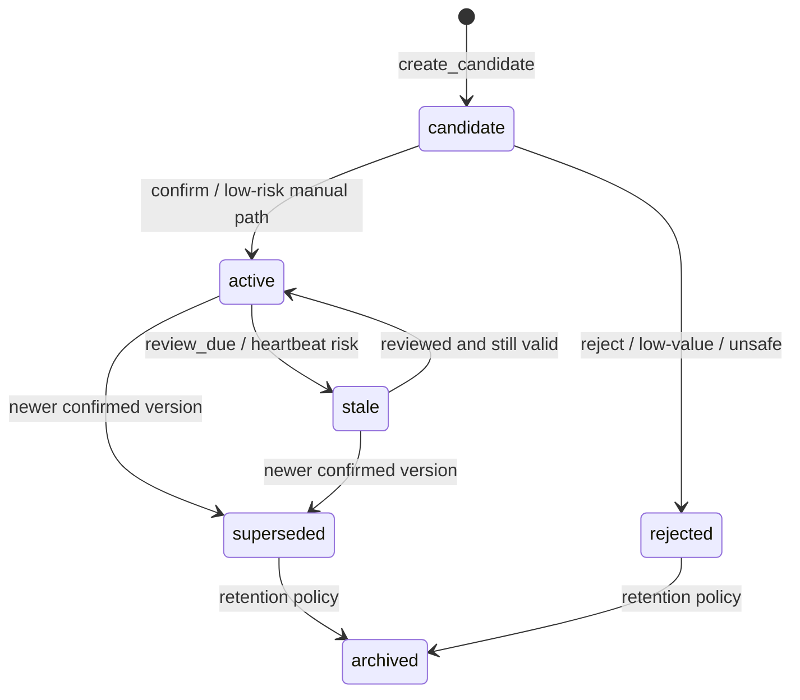
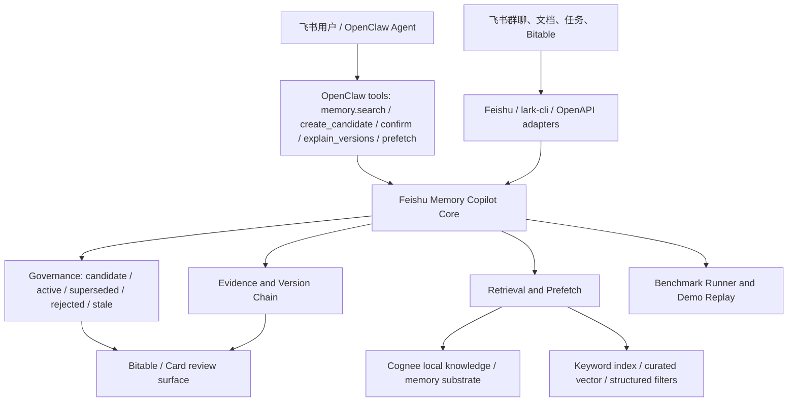

# Memory Definition and Architecture Whitepaper

日期：2026-05-05
项目：Feishu Memory Copilot
阶段：初赛可提交初稿

> **状态更新（2026-04-28）**：本白皮书对应的 2026-05-05 文档任务已经完成，保留为初赛证明材料和产品化参考。后续不要从 2026-05-05 implementation plan 继续执行；新的执行入口是 `docs/productization/full-copilot-next-execution-doc.md`。
>
> **Phase E 审查补充（2026-04-28）**：白皮书原始边界是 2026-05-05 初赛初稿口径；当前仓库已经补齐 Phase B OpenClaw Agent runtime 受控证据和 Phase D live Cognee / Ollama embedding gate。可以说 runtime evidence 和 live embedding gate 已完成；仍不能说生产部署、全量 Feishu workspace ingestion、长期 embedding 服务、完整多租户后台或 `memory.*` first-class OpenClaw 原生工具注册已经完成。

## 先看这个

1. 本文回答初赛材料里的三个问题：Define it、Build it、Prove it。
2. Feishu Memory Copilot 不是普通聊天搜索，也不是把 Cognee 包一层 API；它是面向飞书协作场景的企业记忆治理系统。
3. OpenClaw 是 Agent 入口和工具编排层，Copilot Core 是企业记忆治理层，Cognee 是本地 knowledge / memory substrate，飞书和 Bitable/Card 是办公数据、展示和审核层。
4. 当前已经可证明的能力是：当前有效结论召回、冲突更新、版本解释、任务前 prefetch、heartbeat reminder candidate、Benchmark 自证和 5 分钟 Demo dry-run。
5. 本阶段不用做真实飞书生产推送、完整多租户后台或复赛级大规模压测；这些都放在局限和复赛路线里。

## 1. 背景：为什么飞书协作需要企业记忆

飞书项目协作里，重要信息通常散落在群聊、文档、会议纪要、任务和多维表格里。团队可能先在群聊里定下“生产部署 region 用 cn-shanghai”，后面又有人补一句“不对，统一改成 ap-shanghai”；也可能在文档里写过周报、评测、Demo 或上线规则，但几天后做事的人只记得“好像说过”，需要重新翻消息。

普通搜索能把相关聊天找出来，但它不会判断哪条是当前有效结论，也不会主动解释旧版本为什么失效。对 Agent 来说，这个问题更明显：OpenClaw Agent 如果没有项目长期上下文，就会把每次任务当成从零开始，生成计划、检查清单或答复时很容易漏掉过去已经定下的规则。

Feishu Memory Copilot 要解决的是这个办公痛点：

- 少翻群聊：用户问历史决策时，直接返回当前有效结论。
- 少重复讨论：旧结论和新结论同时存在时，系统保留版本链，但默认只用 active 当前值。
- 少误用旧信息：superseded 或 stale 记忆不能混入当前答案。
- 让 Agent 做事前有上下文：Agent 开始生成计划、检查清单、报告或答复前，可以调用 `memory.prefetch` 取到短上下文包。
- 让评委能信任：每条结论都带 evidence，不只给“模型说是这样”。

这里的 Memory 不是“把所有聊天长期保存”。真正值得进入系统的是会影响后续行动、决策一致性、责任分工、流程规则或风险判断的信息。

## 2. Define It：本项目里的 Memory 是什么

### 2.1 核心定义

在 Feishu Memory Copilot 里，Memory 是一条带状态、证据、版本和权限范围的企业协作结论。

一条合格的 Memory 至少回答：

| 字段 | 白话解释 | 示例 |
|---|---|---|
| `scope` | 这条记忆属于哪个项目、团队或用户范围 | `project:demo` |
| `type` | 记忆类型 | `decision`、`workflow`、`deadline`、`risk` |
| `subject` | 它在讲什么主题 | 生产部署 region |
| `current_value` | 当前有效结论 | region 用 `ap-shanghai`，发布加 `--canary` |
| `status` | 当前处于什么状态 | `candidate`、`active`、`superseded` |
| `version` | 第几个版本 | `v2` |
| `evidence` | 证据从哪里来 | 飞书消息、文档段落、Benchmark 样例 |
| `visibility_policy` | 谁可以看或用 | 项目内可见、敏感字段脱敏 |

### 2.2 术语表

| 术语 | 定义 | 为什么重要 |
|---|---|---|
| raw event（原始事件） | 系统看到的原始输入，例如飞书消息、文档片段、benchmark event | 用于审计和复盘，不默认直接给 Agent |
| curated memory（整理后的记忆） | 从 raw event 中抽取、归一化、带状态和证据的长期有效信息 | 默认 search、prefetch 和 benchmark 使用它 |
| evidence（证据） | 支撑记忆的原文 quote、source id、时间或文档位置 | 防止“无来源结论”，让人能回看 |
| candidate（待确认记忆） | 系统认为值得记，但还需要确认或审核的记忆 | 防止闲聊、误识别或高风险内容直接污染当前结论 |
| active（当前有效记忆） | 已确认、默认可被 search / prefetch 使用的记忆 | Agent 做事时优先使用它 |
| superseded（被覆盖的旧记忆） | 被新版本覆盖的旧结论 | 保留历史，但默认不作为当前答案 |
| rejected（已拒绝） | 人或规则判断不应保存的候选 | 避免重复误召回 |
| stale（可能过期） | 需要复核但尚未被新版明确覆盖的记忆 | 后续 heartbeat 可以生成提醒候选 |
| archived（归档） | 不再参与默认召回的历史记录 | 保留审计价值 |
| Benchmark（评测脚本） | 用固定样例跑系统，检查召回、冲突更新、证据覆盖和泄漏率 | 证明能力不是只靠现场演示 |
| Recall@3（前三条召回命中率） | Top 3 结果里能不能找到正确答案 | 衡量用户能否快速找到当前结论 |

### 2.3 状态机

Memory 的状态变化不是简单覆盖数据库字段，而是一个治理流程：



这个设计的关键点是：旧版本不直接删除。旧版本进入 `superseded`，可以用于解释历史和审计；默认 `memory.search` 和 `memory.prefetch` 只使用 `active`，避免旧值泄漏。

## 3. Build It：系统架构和边界

### 3.1 总体架构



### 3.2 分层职责

| 层 | 负责什么 | 不负责什么 |
|---|---|---|
| OpenClaw Agent / tools | Agent 调用 `memory.search`、`memory.prefetch`、`memory.explain_versions` 等工具 | 不直接维护版本链和权限规则 |
| Feishu / lark-cli / OpenAPI adapters | 接入飞书消息、文档、多维表格、卡片和任务看板 | 不成为核心记忆状态机 |
| Memory Copilot Core | 状态机、证据链、版本解释、权限门控、输出契约、benchmark proof | 不把业务逻辑散落到旧 Bot handler |
| Cognee substrate | 本地 knowledge / memory engine，提供数据处理、知识图谱/向量检索等底层能力 | 不替代企业记忆治理，不决定 candidate 是否可 active |
| Bitable / Card review surface | 展示候选、版本链、benchmark 结果和人工审核动作 | 不是 source of truth，不绕过 Core 改状态 |
| Benchmark / Demo | 用固定样例和 dry-run 证明能力 | 不等于复赛级全量压测 |

### 3.3 为什么不是普通 Cognee wrapper

Cognee 是本项目选定的本地开源 memory substrate，它适合承担底层 knowledge / memory engine：把数据组织为可搜索的记忆结构，支持本地 SDK spike 和后续召回通道。

但本项目真正的产品差异在 Copilot Core：

- 哪些内容只是 raw event，哪些内容能变成 candidate。
- candidate 何时能升级为 active。
- 新旧结论冲突时如何产生 superseded 版本链。
- evidence 是否足够，敏感内容是否脱敏。
- OpenClaw tool 输出字段是否稳定，Agent 能否直接使用。
- Bitable/Card 只是 review surface，不能替代 Core 做状态判断。
- Benchmark 如何证明 stale/superseded 不泄漏。

所以 Feishu Memory Copilot 使用 Cognee，但不把项目写成“调用 Cognee API 的 wrapper”。

### 3.4 为什么不是普通 OpenClaw 插件或 CLI 工具

OpenClaw、CLI、旧 Feishu Bot 都是入口或 fallback。主产品不是“一个命令工具”，而是让 Agent 在办公任务中主动获得可信项目记忆。

当前叙事保持 OpenClaw-first：

- Demo 主入口是 OpenClaw tools schema 和 examples。
- `scripts/demo_seed.py` 是 dry-run replay，用于现场兜底。
- 旧 CLI/Bot 路径保留为可复现测试面，不作为新主架构。
- Bitable 和 Feishu Card 用于展示和审核，不直接绕过 Core 写入。

## 4. 治理机制：为什么不会乱记、乱提醒、乱泄漏

### 4.1 Candidate gate：先候选，再确认

系统不会把每条飞书消息都直接写成 active memory。重要信息先进入 candidate（待确认记忆），再由规则、人工动作或低风险路径确认。

适合生成 candidate 的内容包括：

- 决策：技术选型、流程口径、上线规则。
- 负责人和截止时间：谁负责、什么时候交付。
- 风险结论：某个方案不建议做、某个 secret 不能暴露。
- 工作流规则：优先用 lark-cli base，不直接用 Sheets 单元格 API 写 Bitable block。

不应生成 candidate 的内容包括：

- 闲聊。
- 未采纳方案。
- 临时想法。
- 没有 evidence 的高风险结论。

当前 `benchmarks/copilot_candidate_cases.json` 已用 34 条样例证明 candidate precision（候选识别准确率）为 1.0。

### 4.2 Evidence gate：没有证据不能成为可信结论

企业记忆必须能追溯来源。没有 evidence 的内容即使语义看起来正确，也不能作为可靠输出。

Evidence 至少需要说明：

- 原文 quote 或可读片段。
- 来源类型，例如 Feishu message、document、benchmark fixture。
- 来源 ID 或可追踪位置。
- 这条证据为什么支撑当前结论。

这也是为什么白皮书和 Demo 都引用 `docs/benchmark-report.md`、`docs/demo-runbook.md` 和 OpenClaw examples，而不是只写“系统可以做到”。

### 4.3 Version chain：旧值保留，但默认不返回

冲突更新是企业记忆区别于普通搜索的核心能力。系统遇到“刚才说错了”“统一改成”“旧规则不用了”等表达时，不应该简单覆盖旧行，也不应该把旧值和新值一起返回给用户。

正确行为是：

1. 找到同 scope、同 subject 的 active memory。
2. 创建新版本。
3. 新版本确认后成为 active。
4. 旧版本进入 superseded。
5. 默认 search / prefetch 只用 active。
6. 用户需要解释时，`memory.explain_versions` 展示版本链和 evidence。

当前 `benchmarks/copilot_conflict_cases.json` 已覆盖 12 条冲突样例，Conflict Update Accuracy = 1.0，Superseded Leakage Rate = 0.0。

### 4.4 Permission and redaction：先脱敏，再提醒

主动提醒必须克制。MVP 中 heartbeat 不真实发群，只生成 reminder candidate / dry-run 输出。

提醒前需要过这些门：

- importance gate：是否足够重要。
- relevance gate：是否和当前项目/任务有关。
- cooldown gate：是否刚提醒过，避免打扰。
- scope permission gate：当前上下文是否有权看到。
- sensitive redaction gate：secret、token、api_key 等敏感内容必须脱敏。

当前 `benchmarks/copilot_heartbeat_cases.json` 的 Sensitive Reminder Leakage Rate = 0.0，说明敏感提醒样例不会泄漏原文 secret。

### 4.5 Prefetch：给短上下文包，不塞原始聊天

`memory.prefetch` 的目标不是把所有相关聊天都塞给 Agent，而是在任务开始前给一个 compact context pack（短上下文包）：

- relevant memories：和任务相关的 active 记忆。
- evidence：可回看的证据。
- risk/deadline：风险和截止信息。
- version status：是否覆盖过旧版本。
- trace summary：为什么选中这些记忆。
- `raw_events_included=false`：默认不带原始事件流。

这让 Agent 像一个靠谱同事：在做事前提醒“当前部署规则是什么、证据在哪里、旧值已失效、还有哪些风险”。

## 5. 当前实现对应关系

| 能力 | 当前文件 | 说明 |
|---|---|---|
| OpenClaw tool schema | `agent_adapters/openclaw/memory_tools.schema.json` | 定义 `memory.search`、`memory.create_candidate`、`memory.confirm`、`memory.reject`、`memory.explain_versions`、`memory.prefetch` 等工具契约 |
| OpenClaw examples | `agent_adapters/openclaw/examples/*.json` | 固定历史决策召回、冲突更新、任务前 prefetch 三类演示样例 |
| OpenClaw skill 文档 | `agent_adapters/openclaw/feishu_memory_copilot.skill.md` | 给 OpenClaw 侧说明何时调用 memory tools |
| Copilot schemas | `memory_engine/copilot/schemas.py` | 统一 Memory、Evidence、Candidate、ToolResult 等数据结构 |
| Copilot service | `memory_engine/copilot/service.py` | 工具层背后的服务入口，封装 search、candidate、confirm/reject、versions、prefetch |
| Tool handlers | `memory_engine/copilot/tools.py` | 把 OpenClaw 工具输入输出转成稳定 JSON contract |
| Governance | `memory_engine/copilot/governance.py` | candidate / active / superseded / rejected / stale / archived 状态逻辑 |
| Retrieval | `memory_engine/copilot/retrieval.py` | structured filter、keyword、curated vector、Cognee optional channel、rerank |
| Orchestrator | `memory_engine/copilot/orchestrator.py` | L0/L1/L2/L3 cascade 和 trace 组织 |
| Cognee adapter | `memory_engine/copilot/cognee_adapter.py` | 窄 adapter，避免业务代码到处直接 `import cognee` |
| Embedding lock | `memory_engine/copilot/embedding-provider.lock` | 锁定本地 Ollama embedding 默认模型 |
| Permissions | `memory_engine/copilot/permissions.py` | 权限和可见性策略占位 |
| Heartbeat | `memory_engine/copilot/heartbeat.py` | reminder candidate 和 agent run summary candidate dry-run |
| Benchmark runner | `memory_engine/benchmark.py` | 运行 day1 fallback、copilot recall/candidate/conflict/layer/prefetch/heartbeat benchmark |
| Benchmark cases | `benchmarks/copilot_*_cases.json` | 固定样例和验收字段 |
| Demo replay | `scripts/demo_seed.py` | 生成本地 dry-run replay，不写飞书生产空间 |
| Demo runbook | `docs/demo-runbook.md` | 5 分钟演示脚本、截图需求和故障 fallback |
| Benchmark report | `docs/benchmark-report.md` | PRD 指标映射、样例证据、失败分类和局限 |
| Bitable dry-run | `memory_engine/bitable_sync.py` | Benchmark Results、Candidate Review、Version Chain 等展示字段 |
| 旧 fallback | `memory_engine/repository.py`、`memory_engine/feishu_runtime.py`、`memory_engine/cli.py` | 保留为 legacy fallback 和本地可复现测试面，不作为新功能主入口 |

## 6. Prove It：Demo 和 Benchmark 证明

### 6.1 Demo 证明路径

`docs/demo-runbook.md` 已固定 5 分钟 OpenClaw-native Demo：

1. 历史决策召回：`memory.search` 返回 active 部署规则、evidence、matched_via、why_ranked 和 trace。
2. 冲突更新和版本链：`memory.explain_versions` 展示 active 新值和 superseded 旧值。
3. 任务前预取：`memory.prefetch` 返回 compact context pack，过滤旧值，不带 raw events。
4. Heartbeat reminder candidate：只生成 dry-run candidate，不真实发群，敏感内容脱敏。
5. Benchmark 收口：每条演示能力都能在 benchmark 中找到 case、指标和失败分类。

本地复现入口：

```bash
python3 scripts/check_openclaw_version.py
python3 scripts/demo_seed.py --json-output reports/demo_replay.json
```

`reports/` 是本地证据目录，默认不提交。白皮书只引用可复现命令和提交内文档，不依赖未提交的本地报告文件。

### 6.2 Benchmark 指标

截至 `docs/benchmark-report.md` 的 2026-05-03 报告，六类 Copilot benchmark 和 legacy fallback 的结果如下：

| 能力 | 样例数 | 当前结果 | 证明什么 |
|---|---:|---|---|
| copilot_recall | 10 | Recall@3 = 1.0；Evidence Coverage = 1.0；Stale Leakage = 0.0 | 能找回当前有效历史决策，且不泄漏旧值 |
| copilot_candidate | 34 | Candidate Precision = 1.0 | 能区分值得记的协作信息和闲聊/未定方案 |
| copilot_conflict | 12 | Conflict Accuracy = 1.0；Superseded Leakage = 0.0 | 能处理 old -> new 覆盖关系 |
| copilot_layer | 15 | Layer Accuracy = 1.0；L1 Hot Recall p95 = 1.602 ms | 分层召回和 trace 字段可验收 |
| copilot_prefetch | 6 | Agent Task Context Use Rate = 1.0 | Agent 任务前能拿到可用上下文包 |
| copilot_heartbeat | 7 | Reminder Candidate Rate = 1.0；Sensitive Reminder Leakage Rate = 0.0 | 主动提醒候选克制且不泄漏敏感内容 |
| day1 fallback | 10 | case_pass_rate = 1.0 | 旧本地 memory demo 仍可复现 |

### 6.3 代表样例

| 样例 | 证明点 |
|---|---|
| `copilot_recall_deploy_region_001` | 旧 `cn-shanghai` 被覆盖后不进入当前答案，Top 3 返回 `ap-shanghai` 并带 evidence |
| `conflict_region_override_001` | confirm 后新版本 active，旧版本 superseded，版本链可解释 |
| `prefetch_stale_value_filtered` | `memory.prefetch` 只带 active `ap-shanghai`，不泄漏旧 `cn-shanghai` |
| `heartbeat_sensitive_redaction` | reminder candidate 生成前会把 `api_key` 原文脱敏 |
| `copilot_recall_tentative_tool_not_decision_002` | 未采纳的 lark-oapi 讨论不会压过最终 `lark-cli base` 决策 |
| `conflict_demo_recording_flow_012` | Demo 编排从 Bot-first 改为 OpenClaw-first 后，默认答案返回 OpenClaw 主线 |

### 6.4 证明边界

当前证明是 MVP 级，不写成复赛级压力测试：

- Benchmark 样例规模仍小，适合证明链路和指标定义。
- `reports/` JSON / CSV 是本地证据目录，没有提交。
- Cognee optional recall channel 在本地 benchmark 中可以 unavailable；真实 Cognee + Ollama embedding 已由 Phase D live gate 单独验证，但本报告主证据仍是 Copilot Core、状态机、hybrid retrieval、prefetch 和 heartbeat dry-run，不把它写成长期 embedding 服务或 productized live。
- Heartbeat 不真实发群。
- Bitable 是展示和审核面，不是 source of truth。

## 7. 安全、权限和飞书生态边界

### 7.1 数据边界

本项目默认不向量化全部 raw events。embedding 只面向 curated memory 的 subject、current_value、summary 和 evidence quote，避免把整个聊天流都变成不可控长期语义索引。

### 7.2 飞书边界

飞书生态在当前阶段承担三类职责：

1. 数据入口：消息、文档、任务、Bitable 等办公上下文。
2. 交互入口：OpenClaw Agent、卡片、dry-run replay、旧 Bot fallback。
3. 展示和审核：Bitable / card 展示候选、版本链和 benchmark 结果。

当前不把飞书生产写入当作白皮书阶段硬验收。共享任务看板同步是项目管理行为，不等于 Copilot 真实生产写入已经完成。

### 7.3 权限边界

MVP 预留 `tenant_id`、`organization_id`、`visibility_policy` 等权限字段和 permission gate，但还没有完整企业级多租户后台。白皮书不能把这一点写成已完成。

当前可证明的是：

- tool 输出结构里保留 scope 和 visibility 语义。
- heartbeat 会走敏感信息脱敏。
- reminder candidate 不自动发群，不绕过确认。
- Bitable/Card 是 review surface，不能直接替代 Copilot Core 状态机。

## 8. 评委可看的截图和图表位置

2026-05-06 准备提交材料和录屏时，优先截图这些位置：

| 材料 | 位置 | 说明 |
|---|---|---|
| 架构边界 | 本文 `3.1 总体架构` | 展示 OpenClaw / Core / Cognee / Feishu / Bitable 分工 |
| 状态机 | 本文 `2.3 状态机` | 展示 candidate -> active -> superseded / rejected / stale |
| Demo 输出 | `docs/demo-runbook.md` 和 `reports/demo_replay.json` | 展示 `memory.search`、`memory.prefetch` 的真实 tool response |
| Benchmark 指标 | `docs/benchmark-report.md` 的 PRD 指标映射表 | 展示六类指标全部可复现 |
| 样例证据 | `docs/benchmark-report.md` 的样例证据表 | 展示不是空喊智能 |
| OpenClaw tools | `agent_adapters/openclaw/memory_tools.schema.json` | 展示 Agent 入口稳定 |
| 版本锁 | `python3 scripts/check_openclaw_version.py` 输出 | 展示 OpenClaw 固定为 2026.4.24 |

## 9. 当前局限

本阶段需要诚实说明这些风险：

- OpenClaw Agent runtime 已有受控证据：Agent 通过 `exec` 调用仓库证据脚本进入 `handle_tool_request()` / `CopilotService`，但 `memory.*` 仍未声明为 OpenClaw first-class 原生工具列表项，OpenClaw Feishu websocket running 证据也未完成。
- 真实 Cognee / Ollama embedding 已由 Phase D live gate 单独验证，但不能把它写成长期 embedding 服务、默认生产门禁，或说所有 benchmark 都跑了真实 Cognee 搜索。
- heartbeat 仍是 reminder candidate / dry-run，不真实发群。
- Bitable / Card 是 review surface，不是 source of truth。
- 完整多租户权限后台、审计 UI、管理员配置和跨组织隔离还未完成。
- Benchmark 样例是 MVP 规模，适合初赛自证，不代表最终生产压测。
- 旧 CLI/Bot/repository 路径仍存在，当前作为 fallback/reference；后续需要逐步迁移或收敛入口。

## 10. 2026-05-07 之后的复赛路线

复赛路线按“先增强可信度，再扩大规模”的顺序推进：

1. OpenClaw first-class 工具注册：让 `memory.*` 出现在 OpenClaw Agent 原生工具列表中，而不是只通过 `exec` 跑证据脚本。
2. OpenClaw Feishu websocket running 证据：证明同一个 `Feishu Memory Engine bot` 只由一个监听入口接管。
3. Feishu review loop：让 Candidate Review card 和 Bitable review surface 与 Copilot Core 状态机联动，但仍不绕过 evidence gate。
4. Cognee recall channel：在 benchmark 中明确区分 structured、keyword、vector、Cognee 的贡献，并记录 p50/p95。
5. 权限后台：实现 tenant、organization、scope、visibility_policy 的管理和审计。
6. 复赛级 benchmark：扩展更多真实企业对话、多轮冲突、跨文档证据、权限边界和长时间 heartbeat 样例。
7. 录屏和部署体验：把 5 分钟 Demo 固定成一键 replay、截图清单和失败降级包。
8. 旧入口收敛：把旧 CLI/Bot handler 继续封装到 Copilot Core 后面，避免双轨逻辑长期分叉。

## 11. 一句话收口

Feishu Memory Copilot 把飞书协作里的长期有效规则从聊天噪声中提炼成带状态、证据、版本和权限边界的企业记忆。OpenClaw Agent 用 tools 读取这些记忆，Copilot Core 管治理，Cognee 提供本地 memory substrate，飞书/Bitable/Card 负责办公集成和审核展示。当前 Demo 和 Benchmark 已证明：它能返回当前结论、解释旧版本、任务前主动预取、生成克制提醒候选，并且不会把 stale/superseded 或敏感内容混入默认输出。
