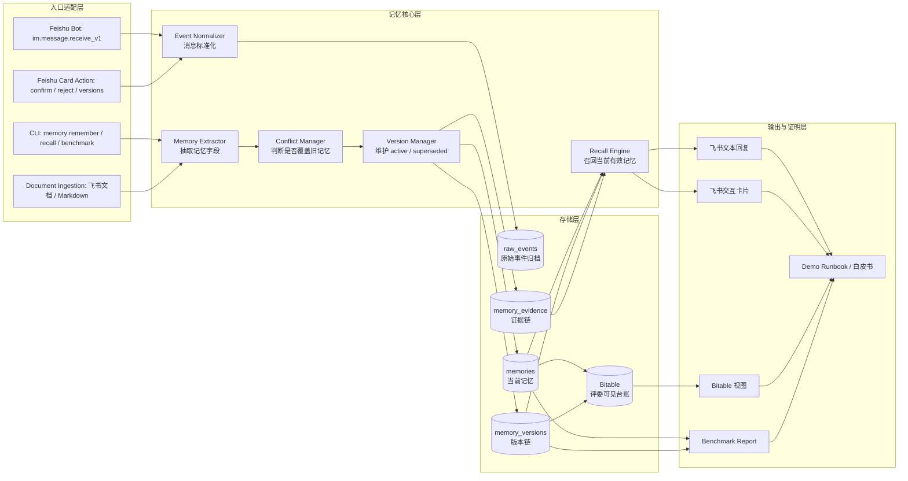

# 项目总览：Feishu Memory Engine

> **状态更新（2026-04-28）**：本文是旧项目总览和架构说明，保留为背景资料。2026-05-05 及以前的 implementation plan 已经完成，不再作为后续执行入口；当前产品化入口是 `docs/productization/full-copilot-next-execution-doc.md`。

本文用来回答一个问题：我们到底在做什么。

## 一句话版

我们在做一个面向飞书协作场景的企业级长期记忆引擎。它把群聊、文档、CLI 操作里真正重要的信息整理成可查询、可更新、可追溯、可评测的“团队记忆”，然后通过飞书机器人、飞书卡片、多维表格和 CLI/OpenClaw 入口重新提供给团队使用。

它不是普通聊天记录搜索，也不是泛化知识库。它重点证明三件事：

1. 重要协作信息可以从飞书场景里沉淀成结构化记忆。
2. 记忆可以处理干扰、冲突和版本更新，只返回当前有效结论。
3. 记忆可以用评测数据证明价值，例如命中率、节省时间、减少重复沟通。

## 我们解决的问题

企业协作里，很多关键上下文散落在不同地方：

- 群聊里说过“生产部署必须加 `--canary`”。
- 文档里写过“后端框架最终采用 FastAPI”。
- 周会里确认过“评测报告周日 20:00 前完成”。
- 之后又有人补充“不对，region 改成 ap-shanghai”。

这些信息通常会被聊天流冲掉。几天后团队再讨论同一个问题时，大模型和新人都不知道以前已经决定过什么，只能重新问、重新搜、重新争论。

本项目要做的是：把这些有长期价值的信息从普通对话里提出来，变成一条条有状态、有来源、有版本的记忆。

## 什么算“记忆”

在这个项目里，记忆不是“所有聊天记录”。记忆必须满足至少一个条件：

- 会影响后续行动，例如部署参数、交付时间、负责人。
- 会影响决策一致性，例如技术选型、方案取舍、风险结论。
- 会影响团队习惯，例如周报发给谁、优先使用哪种视图。
- 以后会被重复查询或复用。
- 需要保留证据来源，方便追溯它从哪里来。

每条记忆都尽量包含这些字段：

| 字段 | 含义 |
|---|---|
| `memory_id` | 记忆唯一编号 |
| `scope` | 记忆属于哪个项目、团队或用户 |
| `type` | 记忆类型，例如 decision、workflow、preference、deadline |
| `subject` | 主题，例如生产部署、后端框架、周报收件人 |
| `current_value` | 当前有效结论 |
| `status` | 当前状态，例如 active、candidate、superseded、rejected |
| `version` | 版本号，用来处理覆盖更新 |
| `source` | 来源证据，例如飞书消息、飞书文档、Benchmark 样例 |

核心原则：旧记忆不要直接删除。发生冲突时，旧版本变成 `superseded`，新版本变成 `active`。这样既能返回当前结论，也能解释为什么旧结论不再有效。

## 产品形态

这个项目不是单一插件，而是一个小型记忆系统，由几个入口组成：

1. **Memory Engine 核心服务**
   - 负责写入、召回、冲突检测、版本管理、证据记录和评测。
   - 当前主要在 `memory_engine/` 里实现。

2. **飞书机器人**
   - 团队在飞书群或单聊里用 `/remember`、`/recall`、`/versions`、`/ingest_doc` 等命令使用记忆。
   - 机器人负责把记忆结果用文本或飞书卡片返回。

3. **飞书多维表格看板**
   - 用来展示记忆台账、版本链和 Benchmark 结果。
   - 它是评委和后续复现者可见的“记忆账本”，不是唯一数据库。

4. **文档 ingestion**
   - 从飞书文档或 Markdown 文件里抽取候选记忆。
   - 候选记忆需要确认后才变成正式 active 记忆。

5. **CLI / OpenClaw 适配方向**
   - CLI 负责本地可运行 Demo 和自动化评测。
   - OpenClaw 后续作为飞书生态和 Agent 能力的展示入口，不阻塞初赛主链路。

因此更准确的定位是：

> 一个以 Memory Engine 为核心、以飞书机器人和多维表格为主要产品界面、可被 CLI/OpenClaw 调用的企业协作记忆系统。

## 具体架构设计

架构按“入口适配层、记忆核心层、存储层、展示与评测层”四层设计。当前初赛版本是单进程本地运行，依赖 `lark-cli` 接飞书长连接，不要求公网服务；后续复赛或生产化再拆成服务端 API、异步 worker 和权限管理后台。

### 1. 总体架构图



### 2. 当前代码模块对应关系

| 架构模块 | 当前代码 | 职责 |
|---|---|---|
| CLI 入口 | `memory_engine/cli.py`、`memory_engine/__main__.py` | 提供 `init-db`、`remember`、`recall`、`versions`、`ingest-doc`、`benchmark`、`bitable`、`feishu` 命令 |
| 飞书事件运行时 | `memory_engine/feishu_runtime.py` | 通过 `lark-cli event +subscribe` 监听消息和卡片事件，写运行日志，调用核心仓储 |
| 飞书事件解析 | `memory_engine/feishu_events.py` | 把飞书原始事件解析成统一 `FeishuMessageEvent`，处理 @ 提及、非文本、自发消息、卡片按钮 |
| 飞书配置 | `memory_engine/feishu_config.py` | 读取 profile、scope、回复模式、卡片模式、日志目录等配置 |
| 飞书回复发布 | `memory_engine/feishu_publisher.py` | 用 `lark-cli` 发送文本或卡片；dry-run 模式用于本地验证 |
| 飞书文案和卡片 | `memory_engine/feishu_messages.py`、`memory_engine/feishu_cards.py` | 生成稳定中文回复和飞书卡片 JSON |
| 记忆抽取 | `memory_engine/extractor.py`、`memory_engine/models.py` | 从输入文本提取 `type`、`subject`、`current_value`、覆盖意图等字段 |
| 记忆仓储核心 | `memory_engine/repository.py` | 实现 `remember`、`recall`、`versions`、候选确认/拒绝、幂等判断、版本更新 |
| 数据库 | `memory_engine/db.py` | 定义 SQLite schema 和连接初始化 |
| 文档导入 | `memory_engine/document_ingestion.py` | 从飞书文档 token/url 或 Markdown 抽取候选记忆 |
| Bitable 同步 | `memory_engine/bitable_sync.py` | 把 SQLite 里的记忆、版本链、评测汇总同步到多维表格 |
| 评测 | `memory_engine/benchmark.py` | 运行抗干扰、矛盾更新、文档导入等评测，并输出 JSON/CSV/Markdown |

这个映射很重要：后续做功能时，先判断属于哪一层，不要把展示逻辑、飞书事件解析和记忆状态机混在一起。

### 3. 存储模型

当前主存储是 SQLite，Bitable 是展示和人工审核副本。

#### `raw_events`：原始事件归档

用途：保留系统看见过的输入，支持审计、去重和失败复盘。

关键字段：

- `id`：内部事件 ID。
- `source_type`：来源类型，例如 `feishu_message`、`benchmark`、`document_markdown`。
- `source_id`：外部来源 ID，例如飞书 `message_id`。
- `scope_type`、`scope_id`：项目或团队范围。
- `sender_id`：发送者。
- `content`：标准化后的文本。
- `raw_json`：飞书原始事件或文档 metadata。

设计点：飞书可能重推同一条消息，所以用 `source_type + source_id` 判断是否处理过，避免重复写入记忆。

#### `memories`：当前记忆表

用途：保存每个主题的当前状态，是默认召回层。

关键字段：

- `id`：`memory_id`。
- `type`：记忆类型，例如 decision、workflow、preference。
- `subject` / `normalized_subject`：主题和标准化主题。
- `current_value`：当前有效结论。
- `status`：`active`、`candidate`、`superseded`、`rejected` 等。
- `active_version_id`：当前有效版本。
- `confidence`、`importance`：后续用于排序和遗忘提醒。
- `last_recalled_at`、`recall_count`：后续用于“哪些记忆长期没被复习”。

设计点：同一 scope 下，`type + normalized_subject` 唯一。这样“生产部署 region”不会无限追加重复主题，而是进入版本更新逻辑。

#### `memory_versions`：版本链

用途：记录每次变更，不直接覆盖历史。

关键字段：

- `memory_id`：所属记忆。
- `version_no`：版本号。
- `value`：该版本的结论。
- `status`：`active` 或 `superseded`。
- `supersedes_version_id`：新版本覆盖了哪个旧版本。
- `created_by`、`created_at`：谁在什么时候改的。

设计点：评委问“你怎么证明系统理解矛盾更新”时，版本链就是证据。

#### `memory_evidence`：证据链

用途：说明记忆从哪里来。

关键字段：

- `memory_id`、`version_id`：对应哪条记忆和哪个版本。
- `source_type`、`source_url`、`source_event_id`：来源类型和来源事件。
- `quote`：原文摘录。

设计点：召回答案必须尽量带 evidence。没有 evidence 的“记忆”更像模型编造，不适合企业场景。

### 4. 核心流程设计

#### 流程 A：`/remember` 写入记忆

```text
飞书消息或 CLI 输入
-> 解析命令和 scope
-> 写入 raw_events
-> Memory Extractor 抽取 type / subject / current_value
-> 查找同 scope、同 type、同 subject 的已有记忆
-> 没有旧记忆：创建 v1 active
-> 有旧记忆且内容相同：记录新 evidence，返回 duplicate
-> 有旧记忆且检测到“不对/改成/以后”等覆盖意图：旧版本 superseded，新版本 active
-> 有旧记忆但没有覆盖意图：返回 needs_manual_review
-> 用文本或卡片回复用户
```

关键设计：

- 写入前不直接信任模型输出，先用规则抽取保证 Demo 可解释。
- 冲突更新必须保留旧版本，不能静默覆盖。
- 没有明确覆盖意图的冲突先进入人工确认，避免误改团队结论。

#### 流程 B：`/recall` 召回记忆

```text
用户查询
-> 标准化 query subject
-> 只查询 status = active 的 memories
-> 按 subject 命中、关键词、类型等规则打分
-> 返回 Top candidates
-> 更新 recall_count 和 last_recalled_at
-> 返回当前有效结论 + 版本号 + evidence
```

当前实现是规则打分，优点是稳定、可解释、方便比赛评测。后续可以在 Recall Engine 后面加 FTS5 或 embedding，但不能替代 active 状态机。

#### 流程 C：文档导入

```text
/ingest_doc <飞书文档 URL/token 或 Markdown path>
-> 读取文档内容
-> 按段落抽取候选记忆
-> 写入 memories，status = candidate
-> 记录 document_title / document_token / quote
-> 用户用 /confirm 或卡片按钮确认
-> candidate 变成 active
-> 用户用 /reject 拒绝
-> candidate 变成 rejected
```

关键设计：

- 文档导入默认先生成候选，不直接污染 active 记忆。
- 每条候选必须带文档标题和原文摘录，方便人工审核。
- Markdown fallback 保证没有真实飞书文档权限时仍能演示。

#### 流程 D：飞书卡片按钮

```text
用户点击卡片按钮
-> 飞书发送 card.action.trigger
-> feishu_events 解析按钮 value
-> 转成内部命令：/confirm、/reject、/versions
-> 复用同一套 handle_message_event 逻辑
-> 回复新卡片或文本 fallback
```

关键设计：

- 卡片动作不另起一套业务逻辑，而是转成内部命令，减少分叉。
- 卡片发送失败时保留文本 fallback，保证 Demo 不被卡片格式问题阻塞。

#### 流程 E：Bitable 同步

```text
SQLite memories / memory_versions / benchmark summary
-> collect_sync_payload
-> dry-run 预览将写入的行
-> 有权限时调用 lark-cli base 写入
-> Bitable 展示 Memory Ledger / Memory Versions / Benchmark Results
```

关键设计：

- SQLite 是运行时事实源，Bitable 是展示副本。
- 初赛采用 append-only 写入，优先保证 Demo 稳定。
- 生产化再补 record_id 映射和更新语义。

#### 流程 F：Benchmark 评测

```text
测试集 JSON
-> 初始化临时 SQLite
-> 注入关键记忆和干扰事件
-> 执行查询
-> 记录命中、旧值泄漏、证据覆盖、延迟
-> 输出 JSON / CSV / Markdown
```

关键指标：

- `Recall@1`：第一条结果就是正确答案的比例。
- `Recall@3`：前三条结果里包含正确答案的比例。
- `stale_leakage_rate`：旧版本错误泄漏率。
- `evidence_coverage`：召回结果带证据的比例。
- `avg_latency_ms`：平均召回延迟。

### 5. 运行拓扑

#### 初赛本地 Demo 拓扑

```text
本机终端
  ├─ python3 -m memory_engine ...
  ├─ scripts/start_feishu_bot.sh
  │    └─ lark-cli event +subscribe
  ├─ data/memory.sqlite
  ├─ logs/feishu-bot/*.ndjson
  └─ lark-cli base/docs/im 调用飞书开放平台

飞书侧
  ├─ 测试群
  ├─ Feishu Memory Engine bot
  ├─ 飞书文档
  └─ Bitable 看板
```

优点：

- 不需要公网回调地址。
- 不需要部署服务器。
- 出问题时可以用 replay fixture 本地复现。
- 适合单人执行快速迭代和录屏。

限制：

- 监听进程在本机，不能长期在线。
- SQLite 适合 Demo 和单机评测，不适合多人高并发生产。
- Bitable 同步目前偏展示，不是强一致业务存储。

#### 后续生产化拓扑

```text
飞书事件长连接
-> API Gateway / Bot Service
-> Queue
-> Memory Worker
-> Postgres / Vector Index
-> Bitable / H5 Console
-> Benchmark & Observability
```

生产化时需要补：

- 队列隔离，避免飞书 3 秒事件处理限制影响抽取逻辑。
- 多租户权限模型，按团队、项目、用户隔离 scope。
- secret 扫描和 prompt injection 防护。
- 管理台审核候选记忆。
- record_id 映射，让 Bitable 支持更新而不是只追加。

### 6. 架构取舍

| 取舍 | 当前选择 | 原因 |
|---|---|---|
| 入口 | 先做飞书 Bot + CLI | 最容易演示，最贴近比赛要求 |
| 事件接入 | 使用 `lark-cli event +subscribe` 长连接 | 不需要公网地址，适合本地比赛 Demo |
| 主存储 | SQLite | 快速、可复现、方便 benchmark |
| 展示存储 | Bitable | 飞书生态原生，评委可直接看 |
| 召回方式 | 规则打分优先 | 可解释、稳定、方便证明抗干扰和矛盾更新 |
| 文档导入 | 先 candidate，再 confirm | 避免文档噪声直接污染长期记忆 |
| 冲突处理 | active/superseded 版本链 | 能证明时序理解和正确覆盖 |
| 卡片体验 | 卡片优先，文本兜底 | 提升观感，同时保证 Demo 不因卡片失败中断 |
| OpenClaw/Hermes | 参考机制，不作为初赛依赖 | 避免引入大依赖拖慢主线 |

### 7. 关键边界

当前架构最需要守住这些边界：

1. **原始事件不等于长期记忆**
   - raw event 可以很多，但只有高价值信息才进入 `memories`。

2. **Bitable 不等于运行时数据库**
   - Bitable 用来展示和审核；召回、评测、版本链以 SQLite 为事实源。

3. **模型能力不等于系统记忆**
   - 真正的记忆必须可查、可更新、可追溯、可评测。

4. **卡片是体验层，不是业务层**
   - 卡片按钮最终转成内部命令，业务逻辑仍在 `MemoryRepository`。

5. **OpenClaw 是调用入口，不是核心存储**
   - 后续可以让 OpenClaw 调用 `remember/recall`，但核心记忆状态机仍由 Memory Engine 负责。

## 当前已经做到什么

截至当前仓库状态，D1-D7 的主线能力已经完成或提前完成。

| 阶段 | 已完成能力 | 作用 |
|---|---|---|
| D1 | 本地 SQLite 记忆引擎、`remember`、`recall`、矛盾更新、Day1 benchmark | 证明记忆核心逻辑可跑 |
| D2 | 飞书 Bot 最小闭环、事件 replay、真实监听入口 | 证明能接入飞书消息 |
| D3 | 真实 Bot 稳定化、`/help`、`/health`、重复消息和异常消息处理 | 让飞书 Demo 可控 |
| D4 | SQLite 同步到 Bitable、多维表格视图和样例数据 | 给评委看得见的记忆台账 |
| D5 | 文档导入、候选记忆、确认/拒绝、文档证据链 | 证明记忆不只来自群聊 |
| D6 | 飞书卡片化表达、版本链和人工确认卡片 | 提升 Demo 表达效果 |
| D7 | 抗干扰 Benchmark、50 条关键记忆 + 1000 条干扰消息 | 用数据证明系统不是靠运气召回 |

当前最重要的主线已经形成：

```text
飞书消息/文档/CLI 输入
-> 原始事件记录
-> 抽取候选记忆
-> 冲突检测和版本管理
-> active 记忆存储
-> recall 召回当前有效结论
-> 飞书卡片 / Bitable / Benchmark 报告展示
```

## Demo 应该怎么讲

建议把 Demo 讲成一个项目团队的真实协作故事。

### 1. 记住一条规则

用户在飞书里发送：

```text
@Feishu Memory Engine bot /remember 生产部署必须加 --canary --region cn-shanghai
```

系统保存为一条 active 记忆，并记录来源。

### 2. 之后能查回来

用户问：

```text
@Feishu Memory Engine bot /recall 生产部署参数
```

系统返回当前有效结论，并显示版本和来源证据。

### 3. 冲突时能覆盖旧结论

用户再发送：

```text
@Feishu Memory Engine bot /remember 不对，生产部署 region 改成 ap-shanghai
```

系统不会简单追加一条重复信息，而是把旧版本标记为 `superseded`，把新版本标记为 `active`。

再查询：

```text
@Feishu Memory Engine bot /recall 生产部署 region
```

系统只返回 `ap-shanghai`，不泄漏旧的 `cn-shanghai`。

### 4. 评委能看到证据

同一条记忆可以在三个地方看到：

- 飞书机器人回复或卡片。
- Bitable 记忆台账。
- Benchmark Report 里的评测结果。

这说明系统不仅“会答”，还可以被审计、被复现、被评测。

## Benchmark 怎么证明价值

比赛要求至少证明三类能力，我们的对应方式是：

| 测试类型 | 我们怎么做 | 证明什么 |
|---|---|---|
| 抗干扰测试 | 放入 50 条关键记忆，再混入 1000 条无关对话，最后跑 50 个查询 | 系统能从大量噪声里找回真正重要的信息 |
| 矛盾更新测试 | 先输入旧规则，再输入“不对，改成新规则” | 系统理解时序和覆盖关系，不返回旧结论 |
| 效能指标验证 | 对比使用前后需要输入的字符数、操作步骤、查找时间 | 系统能节省实际工作成本 |

当前 D7 抗干扰评测闭环、2026-05-03 Benchmark Report、2026-05-04 Demo runbook 和 2026-05-05 白皮书都已经完成。后续不要再按旧 D8/D9 或 2026-05-05 及以前 implementation plan 补任务；如果继续扩展评测，应服务 `docs/productization/full-copilot-next-execution-doc.md` 里的完整产品化缺口。

## 我们不做什么

为了保证单人执行能在初赛前交付，当前明确不把范围做散：

- 不做泛化企业知识库搜索。
- 不默认读取所有群聊消息，避免敏感权限阻塞。
- 不把所有聊天都塞进大模型上下文。
- 不引入 Hermes Agent 作为运行依赖，只参考它的记忆分层、gateway 和安全机制。
- 不把 Bitable 当唯一数据库。Bitable 主要负责可视化、人工审核和评委展示。
- 不让 OpenClaw/H5/遗忘提醒阻塞初赛三大交付物。

## 初赛交付物如何对应

| 比赛交付物 | 我们的产物 |
|---|---|
| 《Memory 定义与架构白皮书》 | 解释记忆定义、系统架构、飞书数据流、企业价值、安全边界 |
| 可运行 Demo | CLI benchmark、飞书 Bot、飞书卡片、Bitable 看板、文档导入 |
| Benchmark Report | 抗干扰、矛盾更新、效能指标三类测试和数据解释 |

初赛的判断标准不是“功能最多”，而是“闭环最稳”：

```text
能输入 -> 能记住 -> 能更新 -> 能召回 -> 能展示 -> 能评测
```

## 接下来最该收口的事

从当前状态看，后续优先级应该是：

1. **补齐 D8 矛盾更新专项 Benchmark**
   - 至少 30 组冲突更新。
   - 明确 stale leakage，也就是旧值误返回率。

2. **补齐 D9 效能指标**
   - 字符数节省。
   - 操作步骤减少。
   - 查询时间或人工查找时间对比。

3. **整理白皮书**
   - 把本文的项目定位扩展成正式白皮书。
   - 加系统图、数据流图、价值证明和安全边界。

4. **整理最终 Demo Runbook**
   - 5 分钟演示顺序。
   - 每一步输入什么、看到什么、截图在哪里。

5. **准备提交材料**
   - README 更新。
   - Benchmark Report 完整化。
   - Bitable 和飞书卡片截图。
   - 录屏脚本和答辩口径。

## 给你自己的判断准则

如果后面做着做着又模糊了，用这几个问题校准：

1. 这个功能是否帮助证明“系统真的记住了”？
2. 它是否能处理旧结论被新结论覆盖？
3. 它是否能给出来源证据？
4. 它是否能被 Benchmark 或 Demo 证明？
5. 它是否服务初赛三大交付物？

如果答案大多是否定的，就先放到复赛或加分项，不要阻塞主线。
